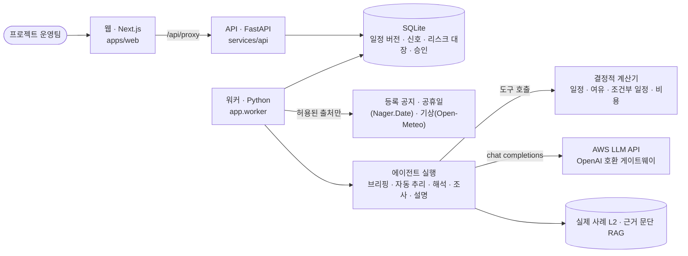

# REPLAN

**협력사 메일에는 일정 영향이 없다고 나옵니다. REPLAN은 메일에 없는 관련 품목을 찾아, 놓칠 뻔한 지연 위험과 확인 기한을 보여줍니다.**

설비 도입 프로젝트 운영팀을 위한 일정 위험 검토 도구입니다.

| 담당자가 본 것 | REPLAN이 추가로 찾은 것 | 다음 결정 |
| --- | --- | --- |
| 메일에 적힌 부품의 통관 지연은 일정에 흡수되어 **0일 영향** | 같은 수출 허가가 필요한 다른 부품은 여유가 없어 **최악 +52일 위험** | 협력사에 해당 여부를 확인한 뒤 대응안 승인 |


> 위 수치와 메일은 **합성 프로젝트 데모**의 결과입니다. 실제 Gmail 연결은 아직 없고, AI 응답은 비용 없이 재생할 수 있는 녹화본입니다. 사람의 확인·승인 전에는 일정을 바꾸지 않습니다.

## 직접 해보기

**배포 주소: http://13.209.206.223** → **데모 보기 → 대표 사례 바로 시작**. 설치 없이 브라우저에서 바로 확인할 수 있습니다(AWS EC2, 녹화된 AI 응답 재생, 비용 0).

로컬에서 실행하려면:

1. Docker를 준비하고 `.env.example`을 `.env`로 복사한 뒤 `REPLAN_DEMO_TOKEN`을 로컬 값으로 정합니다.
2. Windows에서는 `scripts\demo.cmd`, macOS·Linux에서는 `scripts/demo.sh`를 실행합니다.
3. `http://localhost:3000`에서 **대표 사례 바로 시작**을 누릅니다. 예시 일정과 외부 공지가 연결된 프로젝트가 열리면 받은편지함의 대표 통보를 선택하세요.

[화면별 데모 가이드](docs/DEMO_GUIDE.md) · [설치와 실행 설정](#실행-방법)

<details>
<summary>52일 위험을 어떻게 발견하는지 자세히 보기</summary>

1. 협력사는 부품 P-A1의 중국 수출 허가로 통관이 1주 늦어진다고 알립니다. 해당 부품만 계산하면 프로젝트 완료일 변화는 **0일**입니다.
2. REPLAN은 같은 시기의 공지와 메일을 연결하고, 같은 희토류 자석이 든 P-B·P-C를 찾습니다. P-B는 일정 여유로 흡수되지만 P-C는 여유가 없어 허가가 늦으면 완료일이 **52일 늦어질 수 있습니다**. 필요한 서류의 제출 기한은 **2027-02-08**입니다.
3. 담당자가 협력사 회신으로 P-C의 적용 여부를 확인하면 일정을 다시 계산합니다. 대응 조건을 확인·승인한 뒤 새 일정과 Excel을 내보낼 수 있습니다.

</details>

AI Innovators Challenge @ AI Tech Day 2026 예선 제출물입니다. 구현·평가 방식은 아래 [기술 상세](#기술-상세)에 정리했습니다.

## 왜 AI 에이전트인가

규칙과 계산기만으로는 메일에 **적힌** 작업만 계산할 수 있습니다. P-B·P-C는 메일에 없으니 규칙은 알 수 없고, 공지를 키워드로 맞추면 관련 후보가 29개씩 쏟아져 사람이 다 읽어야 합니다.

에이전트는 다음 확인을 스스로 고릅니다. 메일과 공지가 같은 원인인지 판단하고, 같은 원인이 닿을 다른 품목을 찾아보고, 필요한 품목에만 여유 계산과 최악 조건 계산을 부르고, 사람에게 무엇을 언제까지 확인할지 묻습니다. 날짜·기간·비용은 모두 결정적 계산기가 내고, 사람이 확인하기 전에는 일정을 바꾸지 않습니다.

**AWS LLM API는** 백엔드의 한 어댑터(`services/api/app/adapters/llm.py`)에서 OpenAI 호환 chat completions 형식으로 호출합니다. 기준 일정의 위험 브리핑, 새 공지의 자동 분류, 통보 해석, 숨은 영향 조사, 대응안 설명에 쓰고, 하루 호출 한도와 녹화·재생 모드로 비용을 통제합니다.

---

## 기술 상세

### 화면 흐름

작업공간에는 **개요 → 일정 → 감시 → 변경 → 대응안 → 실행 → 이력** 7개 상세 화면이 있습니다. 왼쪽 메뉴는 세 묶음으로 표시하고, 상단의 전체 단계는 필요할 때 펼쳐 볼 수 있습니다(`apps/web/app/stages.ts`).

| 화면 | 사람이 하는 일 | 시스템이 하는 일 |
| --- | --- | --- |
| 일정 | 기준 일정 Excel 연결 | 원본 보존, 작업·선후행·구매 목록을 기준 버전으로 저장 |
| 감시 | 위험 브리핑 확인, 감시 시작, 감시 피드·리스크 대장 확인 | 위험 상위 3~5개 브리핑, 새 공지 자동 분류, 대장 기록 |
| 변경 | 받은편지함에서 통보 등록, 해석 확인 | 통보를 작업·날짜로 해석, 중복·정정 구분 |
| 대응안 | 영향·대응안 비교, AI 조사 시작, 조건 확인·승인 | 계산기가 완료일·비용·제약 계산 |
| 실행·이력 | 새 일정 버전 확정, Excel 내려받기, 기록 확인 | 버전·승인·수집 기록 보관 |

### 아키텍처



API가 분석·조사 요청을 실행 대기열(`runs`)에 넣고, 워커가 수집과 에이전트 실행을 처리합니다. 에이전트 루프는 `services/api/app/agent/runtime.py`, 도구는 `services/api/app/worker.py`와 `investigation.py`·`briefing.py`에 있습니다.

### 구성 요소와 역할

| 구성 | 하는 일 | 하지 않는 일 |
| --- | --- | --- |
| **워커** (수집·변화 감지, AI 아님) | 감시 계획을 활성화하면 출처별 주기로, 또는 **감시 시작** 때 허용된 출처를 수집하고 원문 해시로 실제 변화만 감시 피드에 등록. 근거 문단 색인(SQLite lexical RAG)과 규칙 후보 탐색 | LLM 호출, 일정 변경 |
| **사전 에이전트: 등록 시 브리핑** (`briefing.py`) | 계산기가 속성(원산지·통관·인허가·야외) × 여유·주공정으로 순위를 정하고, 에이전트가 도구 확인 최대 3회로 같은 원인 품목을 더하거나 해당 없는 후보를 뺌. 엑셀에 없는 원인(예: 수출 통제)은 에이전트가 읽은 L2 사례가 있을 때만 연결 | 지연 일수 추정(여유로 취약도만 표시), 순위·숫자 변경 |
| **사전 에이전트: 변화 자동 추리기** | 새 등록 출처 공지(규칙 후보 1개 이상)를 관련 있음 / 확인 필요 / 무관으로 1회 분류, 같은 원인의 대장 위험을 '신호 감지'로 연결 | 조사 자동 시작, 규칙 후보(`related_task_ids`) 덮어쓰기 |
| **사후 에이전트: 협력사 통보 조사** | 사람이 시작. 대장을 읽고 같은 원인이면 '발생'으로 연결, 통보와 공지의 원인 연결, 통보에 없던 품목 찾기, 여유·조건부 영향 계산, 확인 질문·메일 초안. 외부 공지는 '관련 있음'과 사람이 고른 '확인 필요' 작업만 계산 | 일정 수정, 사람 확인 전 대응안 비교, 메일 발송 |
| **리스크 대장** (`risk_register.py`) | 세 에이전트가 공유. 위험마다 예상됨 → 신호 감지 → 발생 → 대응 중 → 종결, 관련 작업·품목, 근거, 변경 이력 | 에이전트의 상태 되돌리기·종결(사람만 가능) |
| **계산기** (`scheduling/`, `shifted_external.py`, `investigation.py`) | 날짜, 여유, 선후행, 밀린 기간의 공휴일·기상 재점검, 조건부 일정, 비용·예산 | 원문 의미 추측 |
| **사람** | 감시 제안 수락, 해석·적용 여부 확인, '확인 필요' 작업 선택, 대응안 승인, 대장 상태 변경 | - |

### AWS LLM API 호출 원칙과 비용 통제

| 언제 | 호출 | 한도 |
| --- | --- | --- |
| 기준 일정 등록 직후 | 브리핑: 도구 확인 최대 3회 + 사례 검색 1회(최대 5턴), 같은 실행에서 감시 계획 보강 1회 | 사람 쪽 일일 한도에 실행 1건 |
| 새 등록 출처 공지(규칙 후보 1개 이상) | 자동 분류 1회 | 별도 일일 한도 `REPLAN_MAX_AUTO_TRIAGE_PER_DAY`(기본 20) |
| 통보 등록(잠정 분석) | 작업·날짜를 찾지 못한 통보만 해석 1회 | `REPLAN_MAX_PAID_RUNS_PER_DAY`(기본 20) |
| 해석 확인 후 정식 분석 | 해석(필요할 때) + 계산된 대응안 설명(최대 8턴) | 같음 |
| 사람이 조사 시작 | 조사 최대 6턴(분류 결과가 없는 공지는 후보 추리 1회 추가) | 같음 |

- 부르지 않는 곳: 수집·해시 비교·규칙 후보 탐색, 계산기, 브리핑의 규칙 순위, 규칙 후보가 없는 공지, 공휴일·기상 신호의 분류. 한도를 넘거나 LLM이 없으면 규칙·계산기 결과만 보여 주고 "에이전트 연결 확인 필요"로 표시합니다.
- 한도는 하루 기준 실행 단위입니다. 실제 호출은 `API_KEY`·`LLM_MODEL`·`LLM_BASE_URL`과 `REPLAN_PAID_CALLS_ENABLED=true`가 모두 있을 때만 일어납니다.
- `REPLAN_LLM_MODE=replay`는 녹화본(`data/llm_replay/hero_demo.json`)만 쓰고 비용이 0입니다. 녹화와 다른 요청은 `replay miss`로 멈춥니다. `record`는 녹화본에 없는 요청만 실제로 호출해 저장합니다.
- LLM에는 등록된 출처의 근거 문단, 기준 일정·구매 목록, 리스크 대장, 계산 결과만 전달합니다. 서버는 인용문이 원문에 실제로 있는지 확인하고, 조사 기록·메일 초안·대응안 설명·브리핑 메모에서 계산기가 내지 않은 숫자·날짜를 지웁니다.

### 에이전트 도구와 멈춤 조건

| 에이전트 | 도구 |
| --- | --- |
| 조사 | `find_procurement_items`(같은 협력사·원산지·통관 품목), `get_task_facts`(작업 속성·품목), `check_schedule_slack`(여유와 기간 상한 흡수 여부), `simulate_conditional`(최악 조건 일정과 행동 기한), `compare_responses`(대응안 비교), `search_risk_signals`(정해진 검색어로 L2 사례), `narrow_candidates`(분류 결과가 없을 때 후보 추리) |
| 브리핑 | `find_procurement_items`, `get_task_facts`, `check_schedule_slack`, `search_risk_cases` |

- 조사 멈춤 조건: M1 관련 없음, M2 완료일 영향 없음(모든 작업이 기간 상한을 흡수), M3 기간이 적혀 있지 않음, M4 사람이 사실을 확인해야 함, M5 계산할 수 없음, done 대응안 비교까지 완료.
- 도구가 막는 전제 조건: 원문에 적힌 기간·날짜만 사용, 여유 확인 전 조건부 일정 금지, 통보에 없던 품목을 사람이 확인하기 전 대응안 비교 금지, 범위 밖 작업 계산 금지.
- 런타임 안전장치: 실행당 도구 호출 최대 8회, 같은 호출 반복 차단, `commit`·`send` 이름의 도구 차단, 잘못된 인자 재시도 최대 2회.

### 데이터

| 데이터 | 성격 | 쓰임 |
| --- | --- | --- |
| L1 hero 프로젝트 `data/l1_project/` | **합성**: 헝가리 배터리 공장, 작업 64개, 구매 품목 6개 | 기준 일정, 데모, 테스트 |
| 협력사 통보·외부 공지 `data/hero_demo/` | **합성**(X2·X1-A는 실제 사례 RS-019·RS-001의 원인을 따름) | 데모, 테스트 |
| L2 실제 사례 `data/l2_risk_signals/` | **실제 기사 19건**, 발행일·링크가 있는 10건만 인용 | 에이전트의 근거 인용(기사 속 지연 일수는 계산에 쓰지 않음) |
| L3 실제 사례 정답 `data/l3_ground_truth/` | **실제 사례 12건** | 평가 스크립트(`scripts/evaluate_hero.py`)의 정답 |
| 공휴일 `data/external/` | 실제 Nager.Date 응답 스냅숏 | 밀린 기간 공휴일 재점검, 오프라인 재현 |
| 녹화본 `data/llm_replay/hero_demo.json` | 실제 LLM 응답 녹화 | 재생 모드 데모와 CI 테스트 |

처리 과정: Excel 업로드 → 시트·열 매핑과 검증 → 기준 버전 저장(원본 보존) → 원인별 위험 순위와 브리핑 → 수집된 공지의 근거 문단 색인·분류 → 통보 해석과 사람의 확인 → 계산기의 일정·비용 계산 → 에이전트 조사(도구 호출) → 사람 승인 → 새 버전과 Excel.

### 결과

| 항목 | 결과 | 근거 |
| --- | --- | --- |
| 숨은 영향 발견(X2) | 메일만 계산하면 0일 → 에이전트가 P-C 최악 +52일, 제출 기한 2027-02-08 발견. 브리핑이 예상한 위험과 연결 | `tests/test_agent_flows_replay.py`, [데모 가이드](docs/DEMO_GUIDE.md) |
| 잘못 연결하지 않음 | 원인이 다른 통보(X2-대조)는 M1으로 멈추고 질문·대장 기록 없음 | 같은 테스트 |
| 비용 절감 | H04 6회·$1.297 → 1회·$0.088, 5개 흐름 합계 $3.185 → $0.370(88% 감소) | [에이전트 감사 기록](docs/AGENT_AUDIT.md) 2-A |
| 테스트 | pytest 148개, 결정적 일정 계산 회귀(REPLAY) 16/16, 외부 변화 회귀 4/4, 녹화 흐름 11개 재생(54건, 누락 0) | `tests/`, `scripts/`, `.github/workflows/ci.yml` |

일정·통보·비용은 합성이고 평가 표본이 작아, 결과를 일반 성능으로 해석할 수 없습니다.

### 실행 방법

**데모(재생 모드, 키·비용 없음)**

```sh
cp .env.example .env           # REPLAN_DEMO_TOKEN을 로컬 값으로 변경
scripts/demo.sh                # macOS·Linux
# Windows: scripts\demo.cmd
```

`http://localhost:3000` → 데모 보기 → 대표 사례 바로 시작. 기존 프로젝트를 열거나 직접 만들려면 데모 화면의 **기존 프로젝트 열기**를 선택합니다.

**실제 LLM 모드**: 서버의 `.env`에만 설정합니다. `.env`와 키는 커밋하지 않습니다.

```env
API_KEY=...
LLM_BASE_URL=https://gateway.example/v1
LLM_MODEL=approved-model
REPLAN_PAID_CALLS_ENABLED=true
REPLAN_MAX_PAID_RUNS_PER_DAY=20
REPLAN_MAX_AUTO_TRIAGE_PER_DAY=20   # Docker Compose 실행에서는 전달되지 않아 기본값 20
REPLAN_LLM_MODE=live
```

Docker 없이 실행하려면 API(`uvicorn app.main:app --app-dir services/api`), worker(`PYTHONPATH=services/api python -m app.worker`), 웹(`apps/web`에서 `npm run dev`)을 같은 `REPLAN_DATA_DIR`와 `REPLAN_DEMO_TOKEN`으로 띄웁니다.

**검증**

```sh
./.venv/bin/python -m pytest -q
cd apps/web && npm run build
./.venv/bin/python scripts/evaluate_replay.py
./.venv/bin/python scripts/agent_flows.py --mode replay
```

### 한계와 향후 계획

- **화면 단순화**: 데모 진입과 단계 표시는 줄였지만, 실제 업무에는 7개 상세 화면과 많은 검토 정보가 남아 있습니다. 다음에는 위험 한 건을 중심으로 확인·결정 흐름을 더 압축해야 합니다.
- **Gmail 연동**: 받은편지함은 합성 메일만 보여 줍니다. 목록은 `InboxMessage` 한 가지 모양(`apps/web/app/inbox.tsx`)이라 메일 출처만 붙이면 됩니다.
- **실시간 웹 검색**: 지금은 등록한 출처만 수집합니다. 승인된 범위의 웹 검색을 근거 저장소에 넣는 것을 계획합니다.
- **검색 도구 개선**: 저장 사례가 영문 분류어로만 검색되어 자유 문장은 찾지 못합니다. 지금은 정해진 검색어 목록으로 우회했고, 인용 가능한 사례가 10건, 통관 자체의 사례는 없습니다.
- 자동 분류 결과는 호출마다 달라질 수 있어 '확인 필요'는 사람이 고른 것만 계산합니다. 일일 한도는 호출이 아니라 실행 단위입니다. 공개 운영 전에는 팀 인증, HTTPS, 운영 DB·백업이 필요합니다.

### 문서

- [데모 가이드](docs/DEMO_GUIDE.md): 화면별 순서와 캡처
- [인수인계 요약](docs/HANDOFF.md): 이번 변경 전체, 알려진 한계
- [제출 점검표](docs/SUBMISSION_CHECKLIST.md): 평가 항목별 근거 위치
- [외부 변화 워크플로](docs/EXTERNAL_RISK_WORKFLOW.md) · [연동 매트릭스](docs/INTEGRATION_MATRIX.md) · [AWS 배포 안내](deploy/aws/README.md)
- 기록: [에이전트 감사](docs/AGENT_AUDIT.md) · [루프 설계](docs/AGENT_LOOP_DESIGN.md) · [UX 점검](docs/UX_AUDIT.md)

## 팀 정보

| 이름 | 역할 | 연락처 |
| --- | --- | --- |
| (작성 예정) | | |
