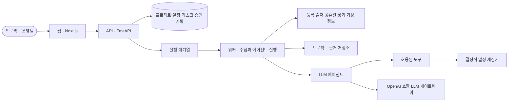

# REPLAN

## 설비 프로젝트의 숨은 일정 리스크를 미리 찾고 대응합니다

REPLAN은 설비 도입·공장 건설 프로젝트 운영팀을 위한 일정 리스크 관리 서비스입니다.

협력사 통보에 적힌 한 가지 품목만 보면 일정 영향이 없어 보일 수 있습니다. REPLAN은 기준 일정과 외부 근거를 함께 검토해 같은 원인의 다른 작업·품목까지 확인하고, 일정에 영향을 줄 가능성이 있는 항목만 담당자에게 보여줍니다.

> 일정은 사람의 확인과 승인 전까지 바뀌지 않습니다.

## 대표 데모

**[배포된 서비스 열기](http://13.209.206.223)**

대표 사례 데모에서는 하나의 설비 프로젝트를 기준으로 다음 흐름을 확인할 수 있습니다.

1. 프로젝트 브리핑에서 프로젝트 범위와 기준 일정 상태 확인
2. 기준 일정에서 작업·기간·선후행 관계 확인
3. 리스크 탐색에서 일정에 영향을 줄 수 있는 외부 신호 수집
4. 리스크 검토에서 수집된 근거와 영향 작업 확인
5. 대응안 비교·승인 후 일정 버전 확정 및 Excel 다운로드

## 해결하려는 문제

기존 프로젝트 운영은 다음 정보가 서로 분리되어 있습니다.

- 기준 일정의 작업·선후행 관계
- 협력사의 변경 통보
- 외부 정책·통관·기상·공휴일 정보
- 실제 사례와 담당자의 확인 기록

이 때문에 통보에 직접 적힌 작업만 계산하거나, 관련된 다른 작업을 사람이 수작업으로 찾아야 합니다. REPLAN은 이 정보를 하나의 프로젝트 맥락으로 연결하고, 일정에 실제로 영향을 줄 수 있는 리스크를 검토 대상으로 좁힙니다.

## 핵심 기능

| 단계 | 사용자 경험 | 시스템 처리 |
| --- | --- | --- |
| 프로젝트 브리핑 | 프로젝트 범위와 현재 상태 확인 | 프로젝트·기준 일정·리스크 상태를 한 화면에 요약 |
| 기준 일정 | Excel 연결 및 기준 버전 확정 | 작업, 기간, 선후행 관계, 구매 품목을 구조화하고 원본 보존 |
| 리스크 탐색 | 감시 시작 및 수집 결과 확인 | 등록된 공식 출처, 공휴일, 장기 계절 노출 정보를 수집 |
| 리스크 검토 | 후보별 근거와 영향 작업 확인 | 통보·문서·외부 신호를 연결하고 검토 대상 후보 생성 |
| 대응안 비교 | 영향과 대응 조건 확인 | 결정적 일정 계산기로 완료일과 영향 범위 계산 |
| 실행·이력 | 대응안 승인, 일정 확정, Excel 다운로드 | 승인된 결과만 새 일정 버전으로 저장하고 모든 판단 기록 보관 |

## AI 에이전트가 하는 일

REPLAN은 규칙과 결정적 계산기를 기본 안전장치로 사용하고, LLM 에이전트는 문서와 근거의 의미를 해석하고 조사 범위를 확장하는 역할을 맡습니다.

1. 기준 일정에서 위험 속성과 일정 여유를 바탕으로 사전 후보를 만듭니다.
2. LLM이 기준 일정·구매 목록·수집된 근거 문단을 읽고 같은 원인과 연결될 후보를 검토합니다.
3. 새로운 공지나 문서가 들어오면 관련 있음·확인 필요·무관으로 분류합니다.
4. 사용자가 확인한 작업과 날짜만 다음 영향 분석으로 전달합니다.
5. 에이전트는 정해진 도구를 통해 작업 사실, 일정 여유, 조건부 일정을 확인합니다.
6. 날짜와 기간 계산은 LLM이 임의로 만들지 않고 결정적 계산기가 수행합니다.
7. 사람의 확인과 대응안 승인 전에는 기준 일정이 변경되지 않습니다.

에이전트는 임의의 웹 탐색이나 일정 변경 권한을 갖지 않습니다. 프로젝트에 연결된 근거 문단과 정해진 도구만 사용하며, 근거에 없는 날짜·기간·수치를 결과에 추가하지 않도록 검증합니다.

## 시스템 구조

## 에이전트 운영 설계

- **문맥 제한**: 에이전트는 해당 프로젝트의 기준 일정·업로드 문서·출처가 확인된 외부 신호만 읽습니다.
- **도구 분리**: AI는 작업·품목·근거 후보를 연결하고, 날짜·선후행 관계·완충기간은 결정론적 일정 계산기가 산정합니다.
- **승인 경계**: 탐지·조사 결과는 후보일 뿐입니다. 담당자가 검토·대응안 승인 전에는 기준 일정과 외부 통보가 바뀌지 않습니다.
- **운영 가드레일**: 도구 호출 수·재시도·일별 실행량을 제한하고, 실행 이력과 근거를 남겨 재현 검증할 수 있게 했습니다.

- **웹**: 프로젝트 브리핑부터 일정 확정까지의 작업공간을 제공합니다.
- **API**: 프로젝트 데이터, 일정 버전, 리스크, 승인 상태를 관리합니다.
- **워커**: 외부 정보를 수집하고 근거를 색인한 뒤, 요청된 에이전트 실행을 처리합니다.
- **RAG**: 프로젝트 일정·품목·외부 근거를 연결해 조사 범위를 제한합니다.
- **LLM 에이전트**: 문서 해석, 후보 검토, 근거 연결, 조사 도구 선택을 수행합니다.
- **계산기**: 선후행 관계, 일정 여유, 조건부 지연을 재현 가능한 방식으로 계산합니다.

## 데이터와 근거

- 대표 데모의 일정·통보·외부 신호는 검증을 위한 시나리오 데이터입니다.
- 외부 리스크 근거는 발행일과 원문 링크가 있는 실제 사례를 별도 저장하고, 프로젝트 기준 시점에 맞는 근거만 사용합니다.
- 근거 문단의 인용 여부와 출처 시점을 기록해 결과를 다시 확인할 수 있습니다.
- 대표 데모는 고정된 프로젝트 흐름으로 제공되며, 사용자가 만든 새 프로젝트는 별도 세션으로 분리됩니다.

## 검증 결과

- 기준 일정·외부 변화·에이전트 흐름에 대한 자동 테스트를 운영합니다.
- 일정 계산은 같은 입력에 같은 결과를 내도록 결정적 계산기로 검증합니다.
- 에이전트가 원인과 무관한 통보를 잘못 연결하지 않는지 별도 시나리오로 확인합니다.
- LLM 호출이 불가능한 경우에도 규칙과 계산기 결과를 유지하고, 사람에게 연결 상태를 명확히 표시합니다.

## 관련 문서

- [대표 데모 가이드](docs/DEMO_GUIDE.md)
- [제출 점검표](docs/SUBMISSION_CHECKLIST.md)
- [에이전트 감사 기록](docs/AGENT_AUDIT.md)
- [외부 리스크 워크플로](docs/EXTERNAL_RISK_WORKFLOW.md)
