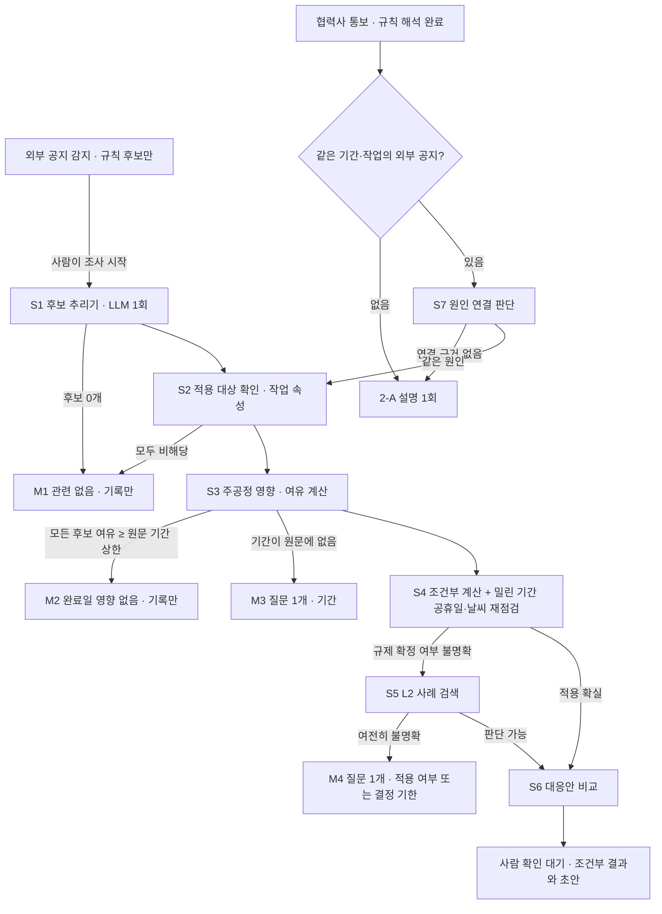

# 에이전트 루프 설계 (2-B 설계안)

이 문서는 설계안입니다. 구현은 확인을 받은 뒤 시작합니다. 여기 적힌 일정 수치는 모두 hero 기준 일정으로 결정적 계산기(`app.scheduling.simulate`)를 돌려 얻은 값이며, LLM 호출 없이 계산했습니다.

## 1. 목표와 원칙

진단(`docs/AGENT_AUDIT.md`)에서 에이전트가 가치를 낸 곳은 모두 LLM 1회 호출이었습니다. 루프는 다음 단계가 앞 단계 결과에 따라 달라지는 일, 즉 **외부 신호 조사**에만 씁니다.

| 일 | 방식 | 이유 |
| --- | --- | --- |
| 작업 ID 없는 통보의 작업 식별(V08) | 1회 호출(`retrieve_related_tasks`) 그대로 | 입력 하나 → 후보와 인용. 다음 단계는 사람이 고름 |
| 공지의 영향 작업 후보 추리기 | 1회 호출(`interpret_notice`)을 확장해 루프의 첫 단계로 사용 | 추리기 자체는 1회로 충분. 확장: 원문에 적힌 날짜·기간·적용 조건을 인용과 함께 추출 |
| 작업·날짜가 명시된 통보(H04·H02) | 규칙 + 계산 뒤 설명 1회(2-A 그대로) | 해석·계산에 조사할 것이 없음 |
| **외부 공지 조사** | **루프** | 적용 대상인지, 주공정에 닿는지, 기간이 원문에 있는지, 규제가 확정인지에 따라 다음 확인이 달라짐 |
| **협력사 통보와 같은 시기 공지의 원인 연결** | **루프**(연결 후보가 있을 때만) | 원인이 같다면 통보에 없는 다른 작업도 확인해야 함 |

지키는 조건:
- 날짜·기간·비용·일정은 계산기만 만듭니다. LLM은 "다음에 무엇을 확인할지", "적용되는지", "원인이 같은지", "사람에게 무엇을 물을지"만 판단합니다. 날짜 더하기·빼기(예: 착수일 − 30일)도 계산기가 합니다.
- 루프가 쓰는 날짜·기간 숫자는 공지 원문에 적힌 값뿐이며, 인용이 원문에 그대로 있어야 합니다(현재 `interpret_notice` 검증과 같은 방식).
- L2 실제 사례는 적용 가능성 판단의 참고일 뿐, 지연 일수를 계산 입력으로 쓰지 않습니다.
- 확정·승인·발송은 사람이 합니다. 루프의 결과는 조건부 계산과 질문 하나까지입니다.
- 2-A의 "자동 감지는 규칙만" 원칙은 유지합니다. 조사 시작 시점은 8절에서 결정이 필요합니다.

## 2. 흐름



## 3. 단계별 갈림길과 멈춤 조건

| 단계 | 하는 일 | 주체 | 갈림길 |
| --- | --- | --- | --- |
| S1 후보 추리기 | 공지에서 영향 작업 후보(인용·이유)와 원문에 적힌 사실(효력일, 기간 상한, 적용 조건)을 인용과 함께 추출 | LLM 1회 + 인용·날짜 검증 | 후보 0개 → M1 |
| S2 적용 대상 확인 | 후보 작업의 속성(국가, 협력사, 같은 협력사 제작 작업의 국가, 단계, 상태)을 받아 공지의 적용 조건과 비교해 `해당/비해당/불명확`으로 분류 | 계산기 조회 + LLM 판단 | 모두 비해당 → M1. 불명확만 남으면 S3은 진행하되 S5로 감 |
| S3 주공정 영향 | 남은 후보의 전체 여유(작업일)와 주공정 여부를 계산 | 계산기 | 원문 기간 상한이 있고 모든 후보 여유 ≥ 상한 → M2. 상한이 없고 주공정 후보가 있음 → M3 |
| S4 조건부 계산·재점검 | 원문 날짜·기간으로 조건부 패치를 만들어 계산(날짜 산술 포함)하고, 밀린 기간의 공휴일·예보를 재점검. 가장 늦은 대응 기한(예: 서류 제출 기한)도 계산 | 계산기 | 수렴 실패 → M5. 규제 확정 여부 불명확 → S5. 확실 → S6 |
| S5 L2 사례 검색 | 비슷한 규제·인허가 사례를 찾아 적용 가능성 판단의 참고로만 사용(통보 이후 발행 사례는 참고 표시) | 계산기 조회 + LLM 판단 | 판단 가능 → S6. 불명확 → M4 |
| S6 대응안 비교 | 조건부 패치로 등록 대응안 조합을 계산(기존 엔진)하고 설명·협의 초안 작성 | 계산기 + LLM 최종 응답 | 끝: 사람 확인 대기 |
| S7 원인 연결 | 협력사 통보의 사유 문구와 같은 기간(±60일)·같은 작업·같은 사유 단어의 외부 공지를 찾아, 두 인용을 근거로 원인이 같은지 판단 | 계산기 조회 + LLM 판단 | 연결 근거 없음 → 2-A 설명 1회로 끝. 같은 원인 → 공지 기준으로 S2~S4를 다른 작업에 적용하고 통보 패치와 합쳐 계산(중복 계산 없이 `combine_patches`) |

| 멈춤 | 조건 | 남기는 것 |
| --- | --- | --- |
| M1 관련 없음 | 후보 0개, 또는 모든 후보가 비해당 | 제외 이유와 인용. 일정 영향 없음으로 기록, 감시 계속 |
| M2 완료일 영향 없음 | 모든 해당 후보의 여유 ≥ 원문 기간 상한 | 후보별 여유 일수와 상한. 기록만, 사람 확인 요청 없음 |
| M3 기간 질문 | 주공정 후보가 있는데 원문에 기간·날짜가 없음 | 질문 1개(예: "검토 기간 상한이 공지되었는지 확인해 주세요") |
| M4 적용·기한 질문 | S5 뒤에도 적용 여부 불명확, 또는 사람이 정해야 할 기한이 있음 | 질문 1개와 계산된 기한·최선/최악 조건부 완료일 |
| M5 계산 불가 | 재점검 수렴 실패, 근거 충돌(같은 작업에 다른 완료일), 출처 대체·기준 버전 변경 | 멈춘 이유. 사람 검토 요청 |
| M6 예산 | LLM 호출 6회, 도구 호출 8회, 같은 도구·인자 반복, 조사당 비용 상한 도달 | 여기까지의 결과와 "조사 중단: 한도" |
| 끝 | S6 완료 | 조건부 대응안 비교, 설명, 협의 초안. 승인 전에는 일정에 반영하지 않음 |

순서는 코드가 강제합니다: `simulate_conditional`은 S3 결과가 있어야, `compare_responses`는 S4가 수렴해야 호출할 수 있고, `ask_person`·`record_no_impact`는 루프를 끝냅니다. 모델은 이 안에서 다음 도구를 고르고, 순서를 어기면 도구가 이유와 함께 거절합니다.

## 4. 도구와 모델에 넘기는 요약 형식

모델에는 요약만 넘기고, 전체 결과는 도구 기록과 화면에만 남깁니다(2-A의 `model_view`와 같은 방식). 각 요약은 1,500자 이내로 제한합니다.

| 도구 | 입력 | 모델이 받는 요약 | 검증 |
| --- | --- | --- | --- |
| `interpret_notice`(S1, 1회) | 공지 원문, 작업 목록 | `{"candidates":[{"task_id","quote","reason"}], "facts":[{"kind":"effective_date|max_duration_days|applies_to","value","quote"}]}` | 인용이 원문에 그대로 있음, 날짜·숫자가 원문에 있음, 작업 ID 존재 |
| `get_task_facts` | `task_ids` | `{"tasks":[{"task_id","name","phase","status","country","supplier_id","supplier_origin_countries":[...],"baseline_start","baseline_finish"}]}` | 최대 10개 작업. `supplier_origin_countries`는 같은 협력사 제작 작업의 국가에서 결정적으로 도출 |
| `check_schedule_slack` | `task_ids`, `bound_days`(원문 값, 선택) | `{"project_finish","target_finish","tasks":[{"task_id","total_float_workdays","on_critical_path","absorbs_bound"}]}` | `bound_days`는 S1 facts에 있는 값만 허용 |
| `simulate_conditional` | `changes:[{"task_id","kind":"hold_after_start|not_before","value","fact_quote"}]` | `{"status","finish_date","finish_shift_days","target_met","latest_action_date","external_additional_shift_days","new_calendar_constraints":[≤8],"changed_task_count","top_changed_tasks":[≤5]}` | 값이 S1 facts의 인용과 일치. `latest_action_date`는 계산기가 착수일 − 기간으로 계산 |
| `search_risk_signals` | `risk_type`, `stage` | `{"results":[{"risk_id","title","published_date","temporal_status","risk_type","country","summary"(≤200자)}]}`(≤5건) | 지연 일수 필드 없음. 통보 이후 발행은 `POST_AS_OF_REFERENCE` |
| `find_related_signals`(S7) | `task_ids`, `days`(기본 60) | `{"signals":[{"event_id","channel","title","published_at","overlapping_task_ids","reason_terms","quote"(≤200자)}]}`(≤5건) | 같은 프로젝트·같은 기준 버전의 확인·검토 중 이벤트만 |
| `compare_responses`(S6) | 조건부 패치(S4 결과 ID) | 2-A의 `scenario_summaries`와 같은 대응안별 요약(≤8안) | S4 수렴 결과에만 호출 가능 |
| `ask_person` / `record_no_impact` | 질문 1개 / 기록 이유 | 없음(루프 종료) | 질문은 1개, 200자 이내 |

최종 응답은 2-A의 7개 키에 `investigation`을 더합니다:

```json
{"investigation": {"path": ["S1", "S2", "S3", "S4", "S6"], "stop": "M4",
  "applicable_task_ids": ["T046", "T053"], "excluded": [{"task_id": "T013", "reason": "설비 설치·시운전이 아닌 인허가 작업"}],
  "cause_link": null, "question": "셀 설비 서류를 2026-11-05까지 제출할 수 있는지 확인해 주세요."}}
```

## 5. 예상 호출 수와 비용

단가는 2-A 녹화의 게이트웨이 비용 헤더 값입니다: 새 입력 약 $6.88 / 100만 토큰(캐시 쓰기로 과금), 같은 대화에서 다시 보내는 앞부분 $0.55 / 100만 토큰(캐시 읽기), 출력 $33 / 100만 토큰(추론 포함). 한 턴의 도구 요청 출력은 약 150토큰, 최종 응답은 약 1,400토큰으로 잡았습니다.

| 경로 | 예시 | LLM 호출 | 입력 토큰(새 / 캐시) | 예상 비용 |
| --- | --- | --- | --- | --- |
| M1 관련 없음 | 무관한 공지 | 1 | 2.8K / 0 | 약 $0.04 (2-A 공지 해석 실측 $0.038) |
| M2 기록만 | X1-B | 3 | 7.5K / 4.5K | 약 $0.10 |
| M4 질문 + 조건부 계산 | X1-A | 5~6 | 11K / 25K | 약 $0.20~0.25 |
| 끝(대응안 비교까지) | X1-A에서 적용 확실할 때 | 6 | 12K / 30K | 약 $0.25 |
| S7 원인 연결 | X2 | 3~4(협력사 해석은 규칙) | 8K / 12K | 약 $0.12~0.15 |
| S7 연결 없음 | X2 대조군 | 1(2-A 설명) | 5K / 0 | 약 $0.08 |

한도: 조사당 LLM 6회·도구 8회·비용 $0.40(헤더 누적). 비교: 1단계 H04 한 번 $1.30, 2-A H04 $0.088. 외부 공지 조사 한 건이 1단계 H04 한 번의 1/5 이하가 되도록 잡았습니다.

## 6. 새 합성 시나리오(데이터 초안)

루프가 실제로 서로 다른 길로 가도록 만든 시나리오입니다. 모두 `[합성]` 표시, hero 기준 일정(기준 시점 2025-08-20, 목표 완료 2027-12-21)을 씁니다. 아래 기대값은 계산기로 확인한 값입니다.

| ID | 입력 | 규칙만 | 루프 기대 경로 | 계산기로 확인한 값 |
| --- | --- | --- | --- | --- |
| X1-A | EU 수입 셀 설비 서류 요건 공지 | 위험 태그 일치 후보 26개, `NEEDS_INPUT`(효력일·기간 요청) | S1 → S2(T046·T053 해당. 인허가 작업 T007·T008·T013·T057은 불명확 또는 비해당. 독일 제작 설비 작업 T047·T054는 후보에 들어와도 비해당) → S3(T046·T053 주공정, 상한 30일 미흡수) → S4 → S5(과도기 미확정) → M4 | 제출 기한 2026-11-05(T046 착수 2026-12-05 − 30일)까지 내면 영향 없음. 늦으면 최악 T046 착수 2027-01-04, 완료 2028-01-18(+28일) |
| X1-B | 헝가리 지방 인허가 처리 지연 공지(최대 45일) | 후보 1개(T013), `NEEDS_INPUT` | S1 → S2(T013 해당) → S3(T013 여유가 45일 이상) → M2 기록만 | T013 착수 2026-02-05로 미뤄도 완료 2027-12-21(변화 0일) |
| X2 | 협력사 통보: T053 시운전 착수 2027-06-14로 연기, 사유 "현지 당국의 수입 설비 서류 보완 요청" | 통보 패치 계산: 완료 2028-01-25. 원인 연결 없음 | S7이 X1-A를 찾음 → 두 인용으로 같은 원인 판단 → S2~S4로 T046에도 적용 → 합산 계산 → 추가 영향 없음, 질문 1개(T046 서류 상태) | 통보만 2028-01-25. T046 최악 보류를 더해도 2028-01-25(추가 0일) |
| X2-대조 | 협력사 통보: T054 시운전 착수 2027-05-24로 연기, 사유 "시험 인력 교대 일정" | 완료 2027-12-28 | S7이 X1-A를 후보로 받지만 사유·적용 조건 불일치 → 연결 없음 → 2-A 설명 1회 | 2027-12-28 |

데이터 초안(구현 시 `data/hero_demo/external_loop_signals.json`, 기대값은 런타임이 읽지 않는 별도 파일 `external_loop_ground_truth.json`):

```json
{
  "label": "SYNTHETIC external-signal loop scenarios for the hero project",
  "data_origin": "SYNTHETIC",
  "notices": [
    {"id": "X1-A", "published": "2025-08-27T08:00:00+00:00",
     "url": "https://environment.ec.europa.eu/news_en#synthetic-x1a",
     "title": "[합성] Battery regulation: due-diligence documentation for imported cell production equipment",
     "content": "[합성] From 2026-11-01, operators installing battery cell production equipment imported from outside the EU must submit additional environmental due-diligence documentation before site installation and commissioning. Competent authorities may take up to 30 days to review. Transitional arrangements are not yet confirmed."},
    {"id": "X1-B", "published": "2025-09-01T08:00:00+00:00",
     "url": "https://environment.ec.europa.eu/news_en#synthetic-x1b",
     "title": "[합성] Local regulatory approval backlog in Hungary",
     "content": "[합성] 헝가리 지방정부 인허가 접수분의 처리 기간이 2025-10-01부터 최대 45일 늘어날 수 있습니다. Local regulatory approval backlog."}
  ],
  "supplier_messages": [
    {"event_id": "X2", "published_at": "2025-09-10T09:00:00+02:00", "channel": "supplier_message",
     "source_label": "Equipment Vendor A / 가상 메일",
     "content": "[가상 메시지] T053 셀 라인 시운전 착수를 2027-06-14 이후로 늦춥니다. 현지 당국의 수입 설비 서류 보완 요청 때문입니다."},
    {"event_id": "X2-C", "published_at": "2025-09-12T09:00:00+02:00", "channel": "supplier_message",
     "source_label": "Equipment Vendor B / 가상 메일",
     "content": "[가상 메시지] T054 모듈 라인 시운전 착수를 2027-05-24 이후로 늦춥니다. 시험 인력 교대 일정 때문입니다."}
  ]
}
```

```json
{
  "label": "Expected loop paths; evaluation only, never read at runtime",
  "cases": {
    "X1-A": {"stop": "M4", "path": ["S1", "S2", "S3", "S4", "S5"],
             "applicable_task_ids": ["T046", "T053"], "must_not_include": ["T047", "T054"],
             "latest_action_date": "2026-11-05", "worst_case_finish": "2028-01-18", "questions": 1},
    "X1-B": {"stop": "M2", "path": ["S1", "S2", "S3"], "applicable_task_ids": ["T013"],
             "finish_shift_days": 0, "questions": 0},
    "X2":   {"cause_link": "X1-A", "supplier_finish": "2028-01-25", "combined_finish": "2028-01-25",
             "additional_task_ids": ["T046"], "questions": 1},
    "X2-C": {"cause_link": null, "supplier_finish": "2027-12-28", "questions": 0}
  }
}
```

## 7. 규칙만과의 차이 측정

세 방식으로 같은 입력을 돌립니다: **규칙만**(에이전트 끔), **1회 호출**(2-A 현재), **루프**(이 설계). 기대값은 6절의 정답 파일과 비교하며, 정답 파일은 런타임이 읽지 않습니다(`test_runtime_import_does_not_open_answer_files`에 파일명 추가).

| 지표 | 정의 | 규칙만에서 예상 |
| --- | --- | --- |
| 영향 작업 정밀도·재현율 | 최종 해당 작업 집합 vs 정답 | X1-A 후보 26개(정밀도 낮음) |
| 멈춤 판정 정확도 | 멈춤 코드(M1~M4, 끝)가 정답과 같은 비율 | 항상 `NEEDS_INPUT`이라 판정 없음 |
| 사람 없이 도달한 계산 | 사람 입력 전에 조건부 완료일·기한이 계산된 비율 | 0% |
| 질문 수와 구체성 | 사람에게 남긴 질문 수, 프로젝트 데이터로 답할 수 있었던 질문 수(0이어야 함) | 매번 2개("적용 지역·설비", "효력일·중단 기간") |
| 원인 연결 정확도 | X2 연결 성공, X2-대조 오연결 없음 | 연결 기능 없음 |
| 숫자 근거율 | 출력 속 날짜·일수·금액이 모두 계산기 값인 비율(기존 지표) | 해당 없음 |
| 비용·시간 | 조사당 호출·토큰·비용·소요 시간, 한도 초과 횟수 | 0 |
| 안정성 | 같은 입력 3회 실행에서 멈춤 코드·해당 작업 집합이 같은 비율 | 결정적 |

절차:
1. 규칙만과 1회 호출은 비용 없이(1회 호출은 2-A 녹화본 재생) 먼저 기록합니다.
2. 루프는 시나리오 4개를 한 번씩 녹화(약 15~20회 호출, 약 $0.7), X1-A·X2를 두 번 더 실행해 안정성을 봅니다(약 20회, 약 $0.6). 합계 40회 이내, 약 $1.3.
3. 이후 수정 확인은 `scripts/agent_flows.py --mode replay`에 새 흐름을 추가해 비용 없이 반복합니다.
4. 결과는 `docs/AGENT_AUDIT.md`의 표 형식(시나리오 × 방식)으로 기록합니다.

## 8. 구현 순서와 결정이 필요한 것

구현 순서(확인 후):
1. 도구 계산기 추가: `get_task_facts`, `check_schedule_slack`(여유 계산), `simulate_conditional`(날짜 산술·기한 포함), `find_related_signals`. 모두 LLM 없이 단위 테스트.
2. `interpret_notice` 확장(facts 추출과 검증).
3. 조사 루프 런타임: 단계 조건을 코드로 강제, 멈춤 코드, 한도, `investigation` 출력.
4. 시나리오 데이터와 정답 파일, 규칙만·1회 호출 측정.
5. 루프 녹화(상한 지정)와 재생 테스트.
6. 화면 표시(보류해 둔 F18·F24~F28과 함께): 조사 경로, 멈춤 이유(사람 확인 대기와 오류 구분), 호출 수·비용.

결정이 필요한 것:
- **조사 시작 시점**: (가) 사람이 카드에서 '조사 시작'을 누를 때만(2-A와 같음, 권장) (나) 수집 직후 규칙 후보가 주공정 작업을 포함할 때만 자동으로, 하루 조사 건수·비용 상한 안에서.
- **M2 기록만 결과의 알림 여부**: 조용히 기록 vs 알림 1건.
- **질문 전달 경로**: 화면의 확인 요청만 vs 협력사 메일 초안까지.
- **감시 계획 보강(F6)**: 루프가 들어오면 없애도 되는지.
