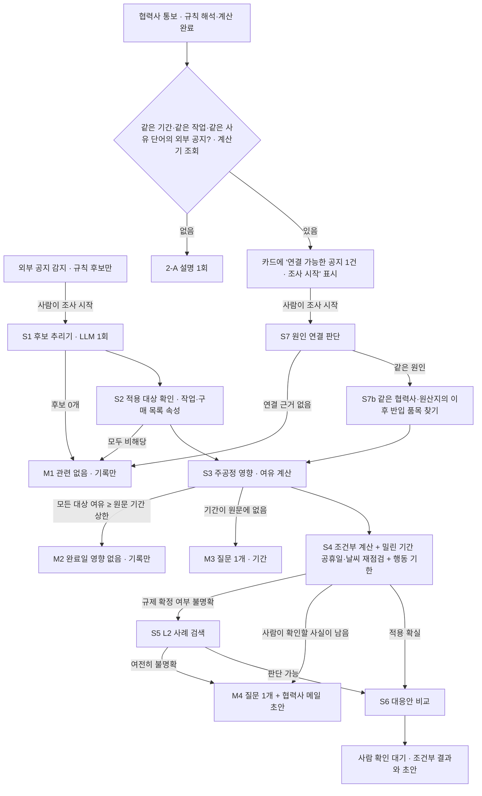

# 에이전트 루프 설계 (2-B 설계안, 보완판)

이 문서는 설계안입니다. 구현은 확인을 받은 뒤 시작합니다. 일정 수치는 모두 hero 기준 일정을 결정적 계산기로 돌려 얻은 값입니다. 워커가 쓰는 경로와 같이 `recheck_shifted_schedule`에 밀린 기간 공휴일 재점검(hero 번들 달력)을 포함했고, LLM은 호출하지 않았습니다.

보완 내용: 작업을 외부 공지에 근거 있게 연결하기 위한 구매 목록 속성(3절), 대표 시나리오 X2 재설계(7절), 결정 사항 반영(9절), 재생 모드에서 프로젝트 표시 이름 제거(10절). 첫 설계의 X1-A 최악 완료일(2028-01-18)은 공휴일 재점검을 빼고 계산한 값이어서 2028-02-01로 고쳤습니다.

## 1. 목표와 원칙

진단(`docs/AGENT_AUDIT.md`)에서 에이전트가 가치를 낸 곳은 모두 LLM 1회 호출이었습니다. 루프는 앞 단계 결과에 따라 다음 확인이 달라지는 일, 즉 **외부 신호 조사**와 **원인 연결**에만 씁니다.

| 일 | 방식 | 이유 |
| --- | --- | --- |
| 작업 ID 없는 통보의 작업 식별(V08) | 1회 호출(`retrieve_related_tasks`) 그대로 | 입력 하나 → 후보와 인용. 다음 단계는 사람이 고름 |
| 공지의 영향 작업 후보 추리기 | 1회 호출(`interpret_notice`)을 확장해 조사의 첫 단계로 사용 | 추리기 자체는 1회로 충분. 확장: 원문에 적힌 날짜·기간·적용 조건을 인용과 함께 추출 |
| 작업·날짜가 명시된 통보(H04·H02) | 규칙 + 계산 뒤 설명 1회(2-A 그대로) | 해석·계산에 조사할 것이 없음 |
| **외부 공지 조사** | **루프** | 적용 대상인지, 주공정에 닿는지, 기간이 원문에 있는지, 규제가 확정인지에 따라 다음 확인이 달라짐 |
| **협력사 통보와 같은 시기 공지의 원인 연결** | **루프** | 원인이 같으면 통보에 없는 다른 설비·작업도 같은 영향을 받을 수 있음 |

지키는 조건:
- 날짜·기간·비용·일정은 계산기만 만듭니다. LLM은 "다음에 무엇을 확인할지", "적용되는지", "원인이 같은지", "사람에게 무엇을 물을지"만 판단합니다. 날짜 더하기·빼기(예: 착수일 − 30일)도 계산기가 합니다.
- 루프가 쓰는 날짜·기간 숫자는 공지·통보 원문에 적힌 값과 구매 목록 값뿐이며, 인용이 원문에 그대로 있어야 합니다.
- 구매 목록은 에이전트 도구가 읽는 사실 자료입니다. 계산기 입력(패치)은 사람이 확인한 변경이나 "조건부"로 표시된 계산에만 들어갑니다.
- L2 실제 사례는 적용 가능성 판단의 참고일 뿐, 지연 일수를 계산 입력으로 쓰지 않습니다.
- 확정·승인·발송은 사람이 합니다. 루프의 결과는 조건부 계산, 질문 하나, 협력사 메일 초안까지입니다.
- **조사는 사람이 "조사 시작"을 누를 때만 시작합니다**(9절). 외부 변화 감지와 규칙 계산은 2-A처럼 LLM 없이 계속합니다.

## 2. 흐름



## 3. 일정 데이터의 연결 고리: 구매 목록 속성

지금 hero 일정에는 작업 위치(`country`)와 담당(`supplier_id`)만 있어, "EU 역외에서 수입하는 설비"라는 공지 조건을 작업에 연결할 근거가 없습니다. 실제 설비 도입 프로젝트의 구매 목록(PO 목록)에 흔히 있는 수준의 항목만 추가합니다.

**(1) 작업 속성 3개**(엑셀 `WBS` 시트에 열 추가, 빈칸 허용)

| 열 | 의미 | hero 값 예 |
| --- | --- | --- |
| `origin_country` | 설비·자재를 만든 나라(작업 위치와 다를 수 있음) | T036·T038·T040·T042: South Korea. T037·T039·T041·T043: Germany |
| `customs_required` | 이 작업의 품목이 EU 역외 수입 통관을 거치는지 | T040·T042: 예. T041·T043: 아니오(EU 역내 이동, 기존 작업 이름은 유지) |
| `permit_required` | 착수 전에 인허가·인증 서류가 필요한지 | T012·T013·T057: 예. T029(변전 설비): 예 |

**(2) 구매 목록 시트 `Procurement`**(선택 시트, 없으면 기존과 같이 동작)

| 열 | 의미 |
| --- | --- |
| `item_id`, `item_name` | 구매 품목 |
| `supplier_id`, `origin_country` | 협력사, 원산지 |
| `quantity`, `incoterms` | 수량, 인도 조건(참고 정보) |
| `customs_required`, `permit_or_certification` | 역외 수입 통관 여부, 필요한 인증·서류(예: CE 적합성 선언) |
| `planned_arrival` | 현장·창고 도착 예정일 |
| `needed_for_task_id` | 이 품목이 있어야 시작할 수 있는 작업 |

hero 구매 목록 초안(모두 `[합성]`):

| item_id | 품목 | 협력사 | 원산지 | 통관 | 도착 예정 | 필요한 작업 |
| --- | --- | --- | --- | --- | --- | --- |
| P-A1 | 셀 설비 1차 선적(코팅·권취·조립기) | Equipment Vendor A | South Korea | 예 | 2026-03-07(T042 통관 완료) | T044 → T045 |
| P-A2 | 모듈·팩 설비 | Equipment Vendor B | Germany | 아니오 | 2026-02-03 | T044 → T045 |
| P-B | 셀 설비 작업자 교육 키트(운전 시뮬레이터) | Equipment Vendor A | South Korea | 예 | 2026-09-20 | T058 인력 채용·교육(착수 2026-10-08) |
| P-C | 셀 라인 교정·계측 장비 세트 | Equipment Vendor A | South Korea | 예 | 2027-03-26 | T051 설비 교정(착수 2027-04-09) |
| P-D | 모듈 라인 시운전 예비 부품 | Equipment Vendor B | Germany | 아니오 | 2027-04-30 | T054 모듈 라인 시운전(착수 2027-05-14) |
| P-E | 변전 설비(변압기·개폐기) | Utility Provider | Hungary | 아니오 | 2026-06-15 | T029 변전 설비 설치(인허가 필요) |

**기존 결과가 바뀌지 않는 이유와 확인**: 새 열과 시트는 계산기(`simulate`, `recheck_shifted_schedule`)가 읽지 않습니다. 공휴일 달력 선택에 쓰는 `country`도 그대로 둡니다. 모든 작업에 새 속성을 넣고 H04를 다시 계산해도 무대응 2028-01-25(통보 지연 21일 + 밀린 기간 공휴일 14일), HOPT-01 2028-01-11로 같았습니다. 구현 시 `test_h04_agent_reviews_calculated_scenarios_once`와 REPLAY 16/16에 더해, 속성이 있는 hero 워크북으로 H04 수치를 확인하는 테스트를 추가합니다.

## 4. 단계별 갈림길과 멈춤 조건

| 단계 | 하는 일 | 주체 | 갈림길 |
| --- | --- | --- | --- |
| S1 후보 추리기 | 공지에서 영향 작업 후보(인용·이유)와 원문에 적힌 사실(효력일, 기간 상한, 적용 조건)을 인용과 함께 추출 | LLM 1회 + 인용·날짜 검증 | 후보 0개 → M1 |
| S2 적용 대상 확인 | 후보 작업과 연결된 구매 품목의 원산지·통관·인허가 속성을 공지의 적용 조건과 비교해 `해당/비해당/불명확` 분류 | 계산기 조회 + LLM 판단 | 모두 비해당 → M1. 불명확이 남으면 S5로 |
| S3 주공정 영향 | 대상 작업의 여유(달력일)와 주공정 여부 계산 | 계산기 | 원문 기간 상한이 있고 모든 대상 여유 ≥ 상한 → M2. 상한이 없고 주공정 대상이 있으면 → M3 |
| S4 조건부 계산·재점검 | 원문 기간·구매 목록 도착일로 조건부 패치를 만들어 계산(날짜 산술 포함), 밀린 기간 공휴일·예보 재점검, 영향을 피하려면 언제까지 행동해야 하는지(`latest_action_date`) 계산 | 계산기 | 수렴 실패 → M5. 사람이 확인할 사실(서류 필요 여부 등)이 남음 → M4. 규제 확정 여부 불명확 → S5. 확실 → S6 |
| S5 L2 사례 검색 | 비슷한 규제·인허가 사례를 찾아 적용 가능성 판단의 참고로만 사용 | 계산기 조회 + LLM 판단 | 판단 가능 → S6. 불명확 → M4 |
| S6 대응안 비교 | 조건부 패치로 등록 대응안 조합 계산(기존 엔진), 설명·초안 | 계산기 + LLM 최종 응답 | 끝: 사람 확인 대기 |
| S7 원인 연결 | 협력사 통보의 사유 문구와 같은 기간(±60일)·같은 작업·같은 사유 단어의 외부 공지를 두 인용으로 비교해 원인이 같은지 판단 | 계산기 조회 + LLM 판단 | 근거 없음 → M1(연결 안 함, 2-A 결과 유지). 같은 원인 → S7b |
| S7b 이후 품목 찾기 | 같은 협력사·원산지이면서 공지 조건(역외 수입·통관)에 맞고, 통보 대상보다 나중에 도착하는 구매 품목을 찾음. 통보에 없는 품목도 포함 | 계산기 조회 | 없음 → 기록. 있음 → 각 품목의 필요 작업으로 S3 |

| 멈춤 | 조건 | 남기는 것 |
| --- | --- | --- |
| M1 관련 없음 | 후보 0개, 모든 후보가 비해당, 원인 연결 근거 없음 | 제외 이유와 인용. 알림 없이 기록, 감시 피드에 "영향 없음 · 이유 보기" |
| M2 완료일 영향 없음 | 모든 대상의 여유 ≥ 원문 기간 상한 | 대상별 여유와 상한. 알림 없이 기록, 감시 피드에 "영향 없음 · 이유 보기" |
| M3 기간 질문 | 주공정 대상이 있는데 원문에 기간·날짜가 없음 | 확인 요청 1개(예: "검토 기간 상한이 공지되었는지 확인해 주세요") |
| M4 확인 질문 | 사람이 확인해야 결정되는 사실이 남음(적용 여부, 서류 필요 여부, 기한 안 준비 가능 여부) | 확인 요청 1개, 계산된 행동 기한과 최선·최악 조건부 완료일, 협력사 메일 초안(발송 전) |
| M5 계산 불가 | 재점검 수렴 실패, 근거 충돌(같은 작업에 다른 완료일), 출처 대체·기준 버전 변경 | 멈춘 이유. 사람 검토 요청 |
| M6 한도 | LLM 6회, 도구 8회, 같은 도구·인자 반복, 조사당 비용 상한 도달 | 여기까지의 결과와 "조사 중단: 한도" |
| 끝 | S6 완료 | 조건부 대응안 비교, 설명, 협의 초안. 승인 전에는 일정에 반영하지 않음 |

순서는 코드가 강제합니다. `simulate_conditional`은 S3 결과가 있어야, `compare_responses`는 S4가 수렴해야 호출할 수 있습니다. `ask_person`·`record_no_impact`는 루프를 끝냅니다. 모델은 이 안에서 다음 도구를 고르고, 순서를 어기면 도구가 이유와 함께 거절합니다.

## 5. 도구와 모델에 넘기는 요약 형식

모델에는 요약만 넘기고 전체 결과는 도구 기록과 화면에만 남깁니다(2-A의 `model_view`와 같은 방식). 각 요약은 1,500자 이내입니다.

| 도구 | 입력 | 모델이 받는 요약 | 검증 |
| --- | --- | --- | --- |
| `interpret_notice`(S1, 1회) | 공지 원문, 작업 목록 | `{"candidates":[{"task_id","quote","reason"}], "facts":[{"kind":"effective_date|max_duration_days|applies_to","value","quote"}]}` | 인용이 원문에 그대로 있음, 날짜·숫자가 원문에 있음, 작업 ID 존재 |
| `get_task_facts` | `task_ids` | `{"tasks":[{"task_id","name","phase","status","supplier_id","origin_country","customs_required","permit_required","baseline_start","baseline_finish","items":[{"item_id","item_name","origin_country","customs_required","planned_arrival"}]}]}` | 최대 10개 작업, 작업당 품목 5개 |
| `find_procurement_items`(S7b) | `supplier_id`, `origin_country`, `customs_required`, `arriving_after` | `{"items":[{"item_id","item_name","supplier_id","origin_country","customs_required","planned_arrival","needed_for_task_id","needed_by"}]}`(≤8건) | 조건은 앞 단계의 사실·인용에서 온 값만. `needed_by`는 필요 작업의 기준 착수일 |
| `find_related_signals`(S7) | `task_ids`, `days`(기본 60) | `{"signals":[{"event_id","channel","title","published_at","overlapping_task_ids","reason_terms","quote"(≤200자)}]}`(≤5건) | 같은 프로젝트·같은 기준 버전의 확인·검토 중 이벤트만 |
| `check_schedule_slack` | `task_ids`, `bound_days`(원문 값, 선택) | `{"project_finish","target_finish","tasks":[{"task_id","float_calendar_days","on_critical_path","absorbs_bound"}]}` | `bound_days`는 S1 facts에 있는 값만 |
| `simulate_conditional` | `changes:[{"task_id","kind":"hold_after_arrival|hold_after_start|not_before","value","fact_quote","item_id"}]` | `{"status","finish_date","finish_shift_days","target_met","latest_action_date","external_additional_shift_days","new_calendar_constraints":[≤8],"changed_task_count","top_changed_tasks":[≤5]}` | 값은 S1 facts 인용 또는 구매 목록과 일치. 날짜 산술(도착일 + 기간, 착수일 − 기간)은 계산기가 함 |
| `search_risk_signals` | `risk_type`, `stage` | `{"results":[{"risk_id","title","published_date","temporal_status","risk_type","country","summary"(≤200자)}]}`(≤5건) | 지연 일수 필드 없음. 통보 이후 발행은 `POST_AS_OF_REFERENCE` |
| `compare_responses`(S6) | S4 결과 ID | 2-A의 `scenario_summaries`와 같은 대응안별 요약(≤8안) | S4 수렴 결과에만 호출 가능 |
| `ask_person` / `record_no_impact` | 질문 1개와 메일 초안 / 기록 이유 | 없음(루프 종료) | 질문 1개, 200자 이내 |

최종 응답은 2-A의 7개 키에 `investigation`을 더합니다.

```json
{"investigation": {"path": ["S7", "S7b", "S3", "S4"], "stop": "M4",
  "cause_link": {"signal_event_id": "N-X2", "supplier_quote": "현지 세관의 수입 서류 보완 요청",
                 "signal_quote": "customs release ... requires additional environmental due-diligence documentation"},
  "items": [{"item_id": "P-B", "needed_for_task_id": "T058", "absorbs": true},
            {"item_id": "P-C", "needed_for_task_id": "T051", "absorbs": false, "latest_action_date": "2027-03-10"}],
  "question": "교육 키트(P-B)와 교정 장비(P-C)도 같은 수입 실사 서류가 필요한지, P-C 서류를 2027-03-10까지 제출할 수 있는지 확인해 주세요."}}
```

## 6. 예상 호출 수와 비용

단가는 2-A 녹화의 게이트웨이 비용 헤더 값입니다: 새 입력 약 $6.88 / 100만 토큰(캐시 쓰기 과금), 같은 대화에서 다시 보내는 앞부분 $0.55 / 100만 토큰(캐시 읽기), 출력 $33 / 100만 토큰(추론 포함). 도구 요청 한 턴의 출력은 약 150토큰, 최종 응답은 약 1,400토큰으로 잡았습니다.

| 경로 | 예시 | LLM 호출 | 입력 토큰(새 / 캐시) | 예상 비용 |
| --- | --- | --- | --- | --- |
| M1 관련 없음 | 무관한 공지 | 1 | 2.8K / 0 | 약 $0.04 (2-A 공지 해석 실측 $0.038) |
| M1 연결 안 함 | X2-대조 | 2 | 6K / 4.5K | 약 $0.06 |
| M2 기록만 | X1-B | 3 | 7.5K / 4.5K | 약 $0.10 |
| M4 원인 연결 + 품목 확인 | **X2** | 5 | 10K / 20K | 약 $0.15~0.20 |
| M4 질문 + 조건부 계산 | X1-A | 5~6 | 11K / 25K | 약 $0.20~0.25 |
| 끝(대응안 비교까지) | X1-A에서 적용 확실할 때 | 6 | 12K / 30K | 약 $0.25 |

한도: 조사당 LLM 6회·도구 8회·비용 $0.40(헤더 누적). 비교 기준: 1단계 H04 한 번 $1.30, 2-A H04 $0.088. 조사는 사람이 시작할 때만 돌므로 하루 비용은 조사 시작 횟수에 비례합니다.

## 7. 시나리오

### 7.1 대표 시나리오 X2: 협력사 통보를 외부 공지와 연결해 통보에 없는 설비를 찾기

| 순서 | 입력·행동 | 결과(계산기 확인값) |
| --- | --- | --- |
| 0 | 외부 공지 N-X2가 수집됨(2026-02-16 발행): EU 역외 수입 셀 제조 설비는 2026-03-01부터 통관 시 추가 환경 실사 서류 필요, 제출 후 검토 최대 30일 | 2-A 규칙대로 카드만 생김(LLM 없음) |
| 1 | 협력사 통보 X2(2026-03-02, Equipment Vendor A): "셀 설비 1차 선적(P-A1)이 현지 세관의 수입 서류 보완 요청을 받아 T042 통관 완료일이 2026-03-07에서 2026-03-14로 1주 늦어집니다." | 규칙이 T042 완료 2026-03-14를 추출. 계산: 완료일 2027-12-21, **변화 0일**(T042는 약 265일 여유). 규칙만이면 여기서 끝 |
| 2 | 계산기 조회로 같은 기간·T042·사유 단어("수입 서류")가 겹치는 N-X2를 찾음 | 카드에 "연결 가능한 외부 공지 1건 · 조사 시작" |
| 3 | 사람이 조사 시작 → S7: 통보 인용 "현지 세관의 수입 서류 보완 요청"과 공지 인용 "customs release … requires additional environmental due-diligence documentation"으로 같은 원인 판단 | 원인 연결 |
| 4 | S7b: `find_procurement_items(Equipment Vendor A, South Korea, 통관 필요, 2026-03-07 이후 도착)` | **P-B 교육 키트**(T058용, 2026-09-20 도착), **P-C 교정·계측 장비**(T051용, 2027-03-26 도착). 둘 다 통보에 없음 |
| 5 | S3: `check_schedule_slack([T058, T051], bound_days=30)` | T058은 약 245일 여유로 30일 흡수. **T051은 여유 0일**(주공정) |
| 6 | S4: `simulate_conditional`로 최악 조건(도착 후 서류 제출, 검토 30일) 계산 | P-B: T058 착수 2026-10-20 이후여도 완료일 **변화 0일**. P-C: T051 착수 2027-04-25 이후 → 완료 **2028-01-11(+21일)**. P-C 서류를 **2027-03-10**(T051 착수 − 30일)까지 내면 영향 0일. A·B·C 최악을 합쳐도 2028-01-11 |
| 7 | M4 멈춤: 확인 요청 1개 + 협력사 메일 초안 | 질문 "교육 키트(P-B)와 교정 장비(P-C)도 같은 수입 실사 서류가 필요한지, P-C 서류를 2027-03-10까지 제출할 수 있는지 확인해 주세요." 메일: Equipment Vendor A에 P-B·P-C 서류 필요 여부와 사전 제출 가능일 문의(발송 전) |
| 8 | (사람이 "P-C 서류 필요, 기한 못 맞춤"이라고 확인한 뒤의 다음 분석) S6 대응안 비교 | 참고 계산: P-C 최악에서 HOPT-06(시운전·통합시험 병행 준비) 적용 시 2027-12-28(+7일), HOPT-05는 2028-01-11 그대로 |

규칙만·1회 호출·루프 비교:

| 방식 | 보는 것 | 완료일 판단 | 사람에게 남기는 것 |
| --- | --- | --- | --- |
| 규칙만 | 통보에 적힌 A(T042)만 | 2027-12-21, 변화 0일 | 없음(할 일 없음) |
| 1회 호출(2-A) | A만, 계산된 대응안 설명 | 2027-12-21, 변화 0일 | A 관련 확인 질문 정도 |
| 루프(이 설계) | A + 공지 연결 + 통보에 없는 B·C | B는 영향 없음, **C는 서류가 늦으면 2028-01-11(+21일)**, 제출 기한 2027-03-10 | 확인 요청 1개와 협력사 메일 초안 |

### 7.2 유지: X1-A (공지 단독 조사, 질문으로 멈춤)

EU 수입 셀 설비 설치·시운전 서류 요건 공지(효력 2026-11-01, 검토 최대 30일, 과도기 미확정). 규칙만: 위험 태그 일치 후보 26개, `NEEDS_INPUT`. 루프: S1 → S2(구매 목록 원산지로 T046·T053 해당. 인허가 작업은 불명확 또는 비해당. 독일 제작 설비 작업 T047·T054는 후보에 들어와도 비해당) → S3(T046 여유 2일, T053 여유 0일로 30일 미흡수) → S4 → S5(과도기 미확정) → M4. 계산기: 서류를 2026-11-05(T046 착수 2026-12-05 − 30일)까지 내면 영향 없음. 늦으면 최악 T046 착수 2027-01-04, 완료 **2028-02-01**(공지 보류만 2028-01-18, 밀린 기간 새 공휴일 +14일).

### 7.3 보조: X1-B (일찍 멈춤)

헝가리 지방 인허가 처리 지연 공지(최대 45일). 규칙만: 후보 T013, `NEEDS_INPUT`(날짜 요청). 루프: S1 → S2 → S3(T013 여유가 45일 이상) → **M2 기록만**. 계산기: T013 착수를 2026-02-05로 미뤄도 완료 2027-12-21(변화 0일). 알림 없이 감시 피드에 "영향 없음 · 이유 보기"로 남습니다. 확인할 것: LLM 3회 이내, 사람에게 질문을 남기지 않음.

### 7.4 보조: X2-대조 (잘못 연결하지 않음)

협력사 통보 X2-C(2026-03-05, Equipment Vendor B): "T054 모듈 라인 시운전 착수를 2027-05-24 이후로 늦춥니다. 시험 인력 교대 일정 때문입니다." 규칙이 T054 착수 제한 2027-05-24를 추출하고 계산 결과는 2027-12-28(+7일)입니다. 같은 기간에 N-X2가 있어 연결 후보로 조회되지만, 사유(인력 일정)가 다르고 Vendor B 품목은 원산지 독일(EU 역내, 통관 대상 아님)이라 **연결하지 않고 M1**. 결과는 규칙만과 같고, 확인할 것은 "B·C 같은 추가 품목을 만들어내지 않음"입니다.

이 문구는 원래 규칙 해석기가 T054 대신 T038·T039·T052를 고르던 문장입니다(명시된 작업 ID를 키워드 일치 작업으로 대체). 해석기를 고친 뒤 이 문구 그대로 테스트로 남겼습니다(`test_named_commissioning_task_is_not_replaced_by_keyword_matches`).

### 7.5 데이터 초안

구현 시 `data/hero_demo/external_loop_signals.json`(런타임 입력)과 `external_loop_ground_truth.json`(평가 전용, 런타임이 읽지 않음)으로 나눕니다. 구매 목록은 hero 워크북의 `Procurement` 시트와 WBS 새 열로 넣습니다(3절).

```json
{
  "label": "SYNTHETIC external-signal loop scenarios for the hero project",
  "data_origin": "SYNTHETIC",
  "notices": [
    {"id": "N-X2", "published": "2026-02-16T08:00:00+00:00",
     "url": "https://environment.ec.europa.eu/news_en#synthetic-nx2",
     "title": "[합성] Customs documentation for imported battery cell production equipment",
     "content": "[합성] From 2026-03-01, customs release of battery cell production equipment imported from outside the EU requires additional environmental due-diligence documentation. Authorities may take up to 30 days to review the documentation after submission."},
    {"id": "X1-A", "published": "2025-08-27T08:00:00+00:00",
     "url": "https://environment.ec.europa.eu/news_en#synthetic-x1a",
     "title": "[합성] Battery regulation: due-diligence documentation for imported cell production equipment",
     "content": "[합성] From 2026-11-01, operators installing battery cell production equipment imported from outside the EU must submit additional environmental due-diligence documentation before site installation and commissioning. Competent authorities may take up to 30 days to review. Transitional arrangements are not yet confirmed."},
    {"id": "X1-B", "published": "2025-09-01T08:00:00+00:00",
     "url": "https://environment.ec.europa.eu/news_en#synthetic-x1b",
     "title": "[합성] Local regulatory approval backlog in Hungary",
     "content": "[합성] 헝가리 지방정부 인허가 접수분의 처리 기간이 2025-10-01부터 최대 45일 늘어날 수 있습니다. Local regulatory approval backlog."}
  ],
  "supplier_messages": [
    {"event_id": "X2", "published_at": "2026-03-02T09:00:00+01:00", "channel": "supplier_message",
     "source_label": "Equipment Vendor A / 가상 메일",
     "content": "[가상 메시지] 셀 설비 1차 선적(P-A1)이 현지 세관의 수입 서류 보완 요청을 받아 T042 통관 완료일이 2026-03-07에서 2026-03-14로 1주 늦어집니다. 보완 서류를 준비 중입니다."},
    {"event_id": "X2-C", "published_at": "2026-03-05T09:00:00+01:00", "channel": "supplier_message",
     "source_label": "Equipment Vendor B / 가상 메일",
     "content": "[가상 메시지] T054 모듈 라인 시운전 착수를 2027-05-24 이후로 늦춥니다. 시험 인력 교대 일정 때문입니다."}
  ]
}
```

```json
{
  "label": "Expected loop paths; evaluation only, never read at runtime",
  "cases": {
    "X2":   {"stop": "M4", "path": ["S7", "S7b", "S3", "S4"], "cause_link": "N-X2",
             "rules_only_finish": "2027-12-21", "found_items": ["P-B", "P-C"],
             "absorbing_items": ["P-B"], "critical_items": ["P-C"],
             "worst_case_finish": "2028-01-11", "latest_action_date": {"P-C": "2027-03-10"},
             "questions": 1, "email_draft_to": "Equipment Vendor A"},
    "X1-A": {"stop": "M4", "path": ["S1", "S2", "S3", "S4", "S5"],
             "applicable_task_ids": ["T046", "T053"], "must_not_include": ["T047", "T054"],
             "latest_action_date": "2026-11-05", "worst_case_finish": "2028-02-01", "questions": 1},
    "X1-B": {"stop": "M2", "path": ["S1", "S2", "S3"], "applicable_task_ids": ["T013"],
             "finish_shift_days": 0, "questions": 0, "notification": false},
    "X2-C": {"stop": "M1", "cause_link": null, "found_items": [], "rules_only_finish": "2027-12-28", "questions": 0}
  }
}
```

## 8. 규칙만과의 차이 측정

세 방식으로 같은 입력을 돌립니다: **규칙만**(에이전트 끔), **1회 호출**(2-A), **루프**(이 설계). 기대값은 7.5절 정답 파일과 비교하며, 정답 파일은 런타임이 읽지 않습니다(`test_runtime_import_does_not_open_answer_files`에 파일명 추가).

| 지표 | 정의 | 규칙만에서 예상 |
| --- | --- | --- |
| 통보 밖 영향 발견 | X2에서 통보에 없는 영향 품목(P-C)을 찾고, 흡수되는 품목(P-B)을 영향 없음으로 분류했는지 | 찾지 못함(A만 반영, 변화 0일) |
| 영향 작업 정밀도·재현율 | 최종 대상 작업·품목 집합 vs 정답 | X1-A 후보 26개(정밀도 낮음) |
| 멈춤 판정 정확도 | 멈춤 코드(M1~M4, 끝)가 정답과 같은 비율 | 항상 `NEEDS_INPUT`이거나 끝, 판정 없음 |
| 사람 입력 전 계산 | 사람 입력 전에 조건부 완료일·행동 기한이 계산된 비율 | 0% |
| 질문 수와 구체성 | 남긴 질문 수, 프로젝트 데이터로 답할 수 있었던 질문 수(0이어야 함) | 공지마다 2개("적용 지역·설비", "효력일·중단 기간") |
| 오연결 | X2-대조에서 원인을 연결하거나 추가 품목을 만든 비율(0이어야 함) | 연결 기능 없음 |
| 숫자 근거율 | 출력 속 날짜·일수·금액이 모두 계산기·구매 목록 값인 비율 | 해당 없음 |
| 비용·시간 | 조사당 호출·토큰·비용·소요 시간, 한도 도달 횟수 | 0 |
| 안정성 | 같은 입력 3회에서 멈춤 코드·대상 집합이 같은 비율 | 결정적 |

절차:
1. 규칙만과 1회 호출은 비용 없이 먼저 기록합니다(1회 호출은 재생).
2. 루프는 시나리오 4개를 한 번씩 녹화(약 15~18회 호출, 약 $0.6), X2·X1-A를 두 번 더 실행해 안정성 확인(약 20회, 약 $0.7). 합계 40회 이내, 약 $1.3.
3. 이후 수정 확인은 `scripts/agent_flows.py --mode replay`에 새 흐름을 추가해 비용 없이 반복합니다.
4. 결과는 `docs/AGENT_AUDIT.md`의 표 형식(시나리오 × 방식)으로 기록합니다.

## 9. 결정 사항

| 항목 | 결정 | 설계 반영 |
| --- | --- | --- |
| 조사 시작 시점 | 사람이 "조사 시작"을 누를 때만 | 외부 공지 카드와, 연결 가능한 공지가 있는 협력사 통보 카드에 "조사 시작" 버튼. 연결 가능 여부 판단은 계산기 조회(LLM 없음) |
| 영향 없음 결과 | 알림 없이 기록 | M1·M2는 알림을 만들지 않고, 감시 피드에 "영향 없음 · 이유 보기"(제외 이유·여유 일수·인용)로 표시 |
| 질문 전달 | 확인 요청 + 협력사 메일 초안 | M3·M4는 기존 확인 요청(`actions`) 1건과 발송 전 메일 초안을 함께 남김. 발송은 사람이 함 |
| 감시 계획 보강 | 유지 | 기준 일정 확정 시 1회 보강 호출은 그대로 둠(`AGENT_AUDIT.md` F6) |

## 10. 재생 모드: 프로젝트 표시 이름 제거

2-A에서 재생은 요청 본문이 녹화와 같아야 맞고, 에이전트 입력에 사용자가 정한 프로젝트 표시 이름(`project.name`)이 들어가 있어 화면에서 만든 프로젝트는 재생되지 않았습니다.

- **변경**: 에이전트 맥락의 `project`에서 `name`을 뺍니다. 워크북에서 온 `project_name`(예: "BatteryCo Hungary …")은 남깁니다. 에이전트 판단에 표시 이름은 필요 없습니다.
- **다른 요청 값 점검**: 프로젝트 ID·실행 ID·수신 시각은 이미 가림 처리합니다. 화면의 합성 통보 불러오기와 직접 입력은 실행기와 같은 값(`source_label`, `simulation_as_of` 등)을 보내고, 공지 해석·작업 후보 검색 요청에는 프로젝트 이름이 없습니다. 실제 인터넷 수집은 `fetched_at`이 매번 달라 재생 대상이 아닙니다(데모는 고정 자료 사용).
- **재녹화(구현 단계)**: 에이전트 설명 호출 5건(H04 1, H02 2, V08 1, 공휴일 1). 공지 해석·작업 후보 검색 2건은 그대로 재사용합니다. 예상 약 $0.35.
- **확인**: 이름이 다른 프로젝트를 API로 만들어 H04·H02를 재생하는 테스트를 추가하고, `scripts/agent_flows.py`의 녹화용 고정 이름(`audit <흐름> rec`)은 없앱니다.

## 11. 구현 순서(확인 후)

0. 규칙 해석기: 명시된 작업 ID가 있는 시험·시운전 통보에서 ID를 우선(7.4절). 완료.
1. 구매 목록: WBS 새 열과 `Procurement` 시트를 가져오기에 추가(없으면 기존 동작). hero 워크북 갱신, H04·REPLAY 불변 테스트.
2. 계산기 도구: `get_task_facts`, `find_procurement_items`, `find_related_signals`, `check_schedule_slack`, `simulate_conditional`. 모두 LLM 없이 단위 테스트, X2 경로 수치(7.1절)를 테스트로 고정.
3. `interpret_notice` 확장(facts 추출과 검증).
4. 조사 루프 런타임: 단계 조건 강제, 멈춤 코드, 한도, `investigation` 출력, 확인 요청·메일 초안 저장.
5. 화면: "조사 시작" 버튼, 감시 피드의 "영향 없음 · 이유 보기", 조사 경로·멈춤 이유(사람 확인 대기와 오류 구분), 호출 수·비용(보류해 둔 F18·F24~F28 포함).
6. 재생 모드 표시 이름 제거와 재녹화(10절), 새 시나리오 녹화(상한 지정), 8절 측정.

## 12. 구현 상태 (2-B 구현 후)

| 항목 | 상태 | 비고 |
| --- | --- | --- |
| 규칙 해석기 수정(0번) | 완료 | X2-대조 원래 문구가 T054 착수 제한으로 해석됨. 테스트 `test_named_commissioning_task_is_not_replaced_by_keyword_matches` |
| 구매 목록 속성·`Procurement` 시트(3절) | 완료 | hero 워크북 반영. H04·REPLAY 16/16·`REPLAN_demo_inputs.xlsx` 업로드 그대로 |
| 계산기 도구(5절) | 완료 | `app/investigation.py`. `find_related_signals`는 도구가 아니라 조사 전 계산기 조회로 맥락에 넣음(LLM 호출 1회 절약) |
| 조사 루프(4절) | 완료 | 사람이 누르는 `POST /api/projects/{id}/events/{event_id}/investigations`. 모든 도구 호출에 `reason` 필수 |
| 화면 | 최소 구현 | 변경 카드의 '외부 신호 조사' 블록: 조사 시작, 멈춤 표시, 원인 연결, 확인 요청, 협력사 메일 초안, 판단 기록('왜'와 결과). 보류해 둔 F18·F24~F28은 그대로 |
| 재생(10절) | 완료 | 표시 이름 제거. 화면에서 만든 프로젝트로 X2 재생 확인(docker compose, `REPLAN_LLM_MODE=replay`) |

설계와 달라진 점:
- **추정 품목의 사람 확인을 코드로 강제**: 실제 모델이 P-C 영향을 계산한 뒤 확인 없이 대응안 비교로 끝낸 녹화가 있었습니다. 협력사 조사에서 통보에 없는 품목이 조건부 계산에 들어 있으면 `compare_responses`가 거절하고 "확인 요청 1개와 협력사 메일 초안을 남기고 M4로 멈추라"고 돌려줍니다.
- **통보가 이름으로 언급한 품목을 맥락에 추가**(`mentioned_items`): 없으면 모델이 물류 작업 담당(Logistics Partner)으로 품목을 찾아 P-B·P-C를 놓쳤습니다.
- **통보가 완료일을 고정한 작업의 여유**는 착수가 아니라 고정된 완료일을 밀어 계산합니다(그렇지 않으면 여유가 검색 상한으로 나옴).
- **실제 모델의 X2 질문**은 "P-C에도 추가 환경 실사 서류 제출과 최대 30일의 당국 검토가 적용됩니까?"였습니다. P-B는 흡수되므로 P-C만 물었고, 제출 기한 2027-03-10은 질문이 아니라 판단 기록과 품목 결과에 표시됩니다.

실제 모델 녹화 현황(`data/llm_replay/hero_demo.json`): X2(설명 1 + 조사 4), X2-대조(설명 1 + 조사 1, M1), H04(설명 1)는 녹화 완료. X1-B는 작업 속성 → 여유 확인(T013 여유 168일, 45일 흡수)까지 녹화했고 마지막 응답이 남았습니다. X1-A, H02, V08 정식 분석, 공휴일 설명은 재녹화가 필요합니다(`AGENT_AUDIT.md` B10). 네 시나리오의 경로는 모두 스크립트 응답 테스트(`tests/test_investigation_flow.py`)로 확인합니다.
