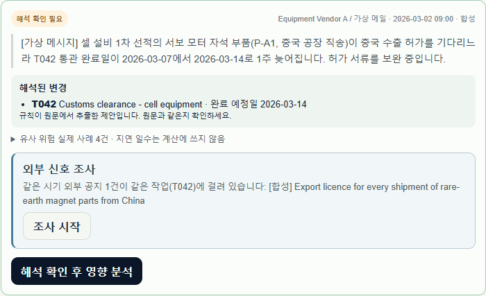
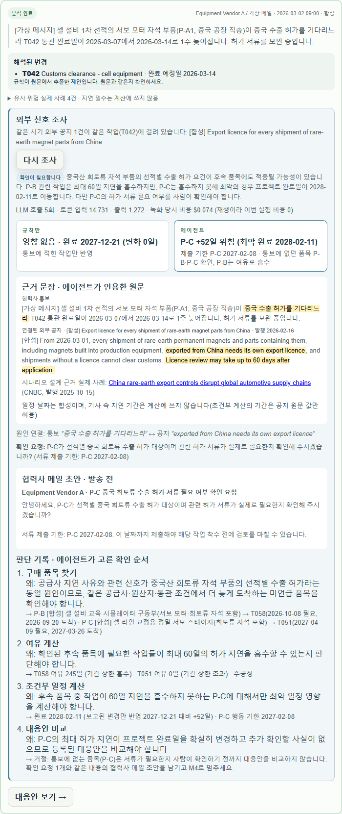
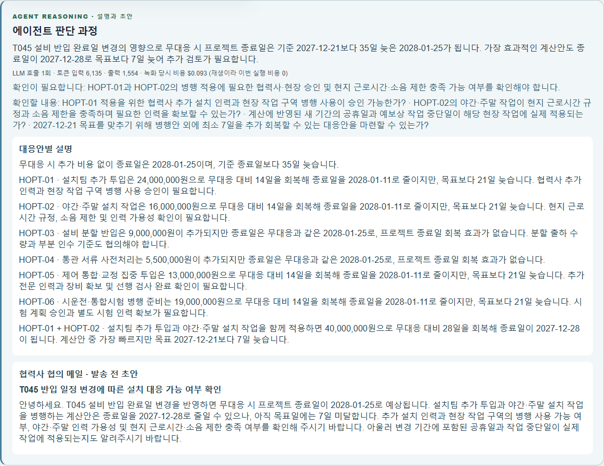

# REPLAN 데모 가이드

작업공간은 6단계를 순서대로 진행합니다: **개요 → 일정 → 변경 → 대응안 → 실행 → 이력**. 각 화면에서 진하게 강조된 버튼이 지금 누를 버튼입니다. 에이전트 기능은 **변경** 단계의 변경 카드('외부 신호 조사': 조사 시작, 조사 결과, 판단 기록)와 **대응안** 단계의 '에이전트 판단 과정'에 있습니다.

## 준비

```sh
REPLAN_LLM_MODE=replay docker compose up -d --build
```

녹화된 LLM 응답으로 에이전트를 재생하므로 키·비용 없이 두 장면이 끝까지 동작합니다. 화면의 비용은 "녹화 당시 비용 … 이번 실행 비용 0"으로 표시됩니다. `http://localhost:3000` → **데모 보기 → 워크스페이스 열기 → 프로젝트 만들기**(이름은 자유) → **일정**에서 **hero 데모 기준 일정 연결**(64개 작업). 두 장면은 새 프로젝트에서 각각 진행하세요.

## 장면 1 — X2: 통보에 없던 숨은 위험

| # | 누를 곳 | 정상 화면 |
| --- | --- | --- |
| 1 | **변경** → 합성 통보 `N-X2 · 합성 외부 공지 · [합성] Export licence for every shipment …` → **합성 통보 불러오기** | 외부 공지 카드(규칙 후보만, 에이전트는 실행되지 않음) |
| 2 | 합성 통보 `X2 · Equipment Vendor A / 가상 메일` → **합성 통보 불러오기** | 해석된 변경 **T042 · 완료 예정일 2026-03-14**, 카드 아래 '같은 시기 외부 공지 1건이 같은 작업(T042)에 걸려 있습니다' |
| 3 | **해석 확인 후 영향 분석** | 대응안 화면으로 이동. 규칙 계산 결과 완료 **2027-12-21, 변화 0일** |
| 4 | **변경**으로 돌아와 X2 카드의 **조사 시작** | 몇 초 뒤 **확인이 필요합니다**. LLM 호출 5회·비용, **규칙만**(영향 없음) 대 **에이전트**(P-C +52일 위험, 최악 2028-02-11, 제출 기한 P-C 2027-02-08) |
| 5 | 같은 카드 아래로 | 에이전트가 인용한 원문 문장 강조(통보·공지), 근거 실제 기사(RS-019, CNBC 2025-10-15), 확인 요청(서류 제출 기한 포함), 협력사 메일 초안(발송 전, 제출 기한 포함) |
| 6 | **판단 기록** | 구매 품목 찾기(P-B → T058, P-C → T051) → 여유 계산(T058 245일 흡수, T051 0일) → 조건부 일정(2028-02-11, 기한 2027-02-08) → 대응안 비교 거절(통보에 없던 품목은 사람 확인 먼저). 단계마다 '왜'가 보임 |
| 7 | (선택) **대응안**에서 안 선택 → 확인 요청 → 승인 → **실행**에서 새 일정 버전 확정 → Excel | 장면 2의 6~8과 같음 |




## 장면 2 — H04: 결정적 계산과 비용 효율

| # | 누를 곳 | 정상 화면 |
| --- | --- | --- |
| 1 | **변경** → 합성 통보 `H04 · Logistics Partner / 가상 메일` → **합성 통보 불러오기** | 해석된 변경 **T045 · 완료 예정일 2026-12-28** |
| 2 | **해석 확인 후 영향 분석** | 대응안 화면으로 이동 |
| 3 | 대응안 목록 | 무대응 **2028-01-25**(35일 지연), 설치팀 추가·야간 작업 등 **2028-01-11**(회복 14일), 두 안 조합 2027-12-28 |
| 4 | `무대응` 선택 | 영향 내역: 통보에 의한 지연 **21일**, 밀린 기간의 외부 제약 추가 **14일**(새로 걸린 공휴일) |
| 5 | 아래 **에이전트 판단 과정** | LLM 호출 1회·비용, 계산된 8개 안의 설명(옵션 ID별), 확인할 내용, 협력사 메일 초안 |
| 6 | `[합성] 야간·주말 설치 작업` → **확인 요청 만들기** → 회신 근거 입력 → **확인 기록** | 조건이 `확인됨`, **이 대응안 승인** 활성 |
| 7 | **이 대응안 승인** | 실행 화면으로 이동 |
| 8 | **새 일정 버전 확정** → **Excel 다운로드** | 확정 버전 카드, `replan-<프로젝트ID>-<버전>.xlsx` |





승인 전에는 '새 일정 버전 확정'이 나타나지 않고, 조건을 확인하기 전에는 '승인'이 비활성입니다.

## 테스트·평가용

아래 시나리오는 회귀 테스트·평가용이며 합성 통보 목록에서 불러올 수 있습니다.

| 자료 | 내용 |
| --- | --- |
| H01~H08 | 협력사 통보 원본. H02 규제 언급(조건부로만 남김), H06 완료일 미정(질문), H07 연락처만 변경(영향 없음), H08 정정 통보 |
| V01~V11 | 표현 변형. V08처럼 작업 번호가 없으면 에이전트가 원문 인용과 함께 후보를 제시하고, 사람이 **영향 작업과 날짜 지정** 후에만 계산 |
| X1-A | EU 역외 설치·시운전 기술자 취업 허가 확인 공지(근거 RS-001). 녹화된 모델은 Vendor A가 비EU 기술자를 투입하는지 먼저 묻고 멈춤 |
| X1-B | 헝가리 인허가 처리 지연(최대 45일). T013 여유로 흡수되어 알림 없이 "완료일 영향 없음 · 기록만" |
| X2-대조 | 사유(시험 인력)가 달라 N-X2와 연결하지 않음("관련 없음 · 기록만") |
| `REPLAN_demo_inputs.xlsx` | 일정 → Excel 파일 선택 → 업로드·미리보기 → 기준 일정 확정. 변경 이벤트 행은 자동 등록되지 않으므로 원문을 붙여 넣음 |
| 외부 변화 감시 | 변경 화면 아래 '외부 변화 감시'에서 제안 수락·제외 후 활성화. 감지된 변화는 규칙만으로 정리되고, 에이전트는 사람이 조사·분석을 시작할 때만 실행 |

녹화된 흐름 9개(H04, H02, V08, 외부 공지, 공휴일, X2, X2-대조, X1-A, X1-B)는 `python scripts/agent_flows.py --mode replay`로 비용 없이 재생해 확인합니다. 에이전트 모드별 차이:

| 모드 | 설정 | 동작 |
| --- | --- | --- |
| 규칙만 | 기본(키 없음 또는 `REPLAN_PAID_CALLS_ENABLED=false`) | 규칙과 계산기만. 에이전트 자리에는 'RULES · 규칙과 계산기' 안내, 조사 블록은 "에이전트가 꺼져 있어" 안내 |
| 재생 | `REPLAN_LLM_MODE=replay` | 녹화된 응답으로 에이전트 동작, 비용 0. 녹화와 다른 요청은 멈춤 |
| 실제 | 키 + `REPLAN_PAID_CALLS_ENABLED=true` | 작업·날짜 없는 통보 해석 1회, 정식 분석 설명 1회, 사람이 시작한 조사(최대 6회). 잠정 분석과 자동 감지는 LLM 없음 |

고급 설정(실행 화면 아래: 협력사 휴무일, 공개 피드, 메일·알림 연결 등)의 연동 여부는 화면에 `분석에 반영`·`저장만`·`미연동`으로 표시됩니다.
