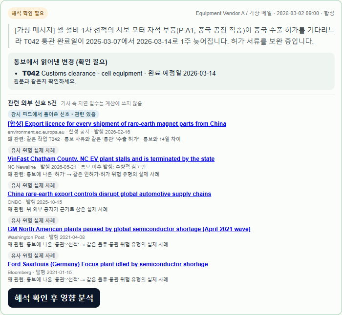
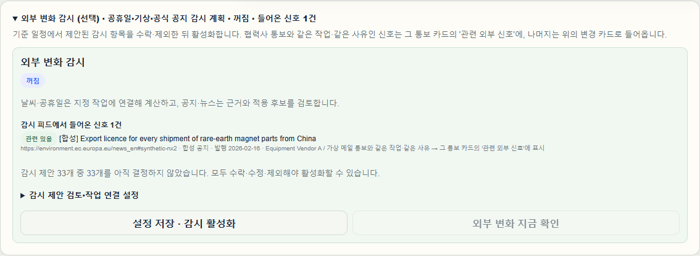
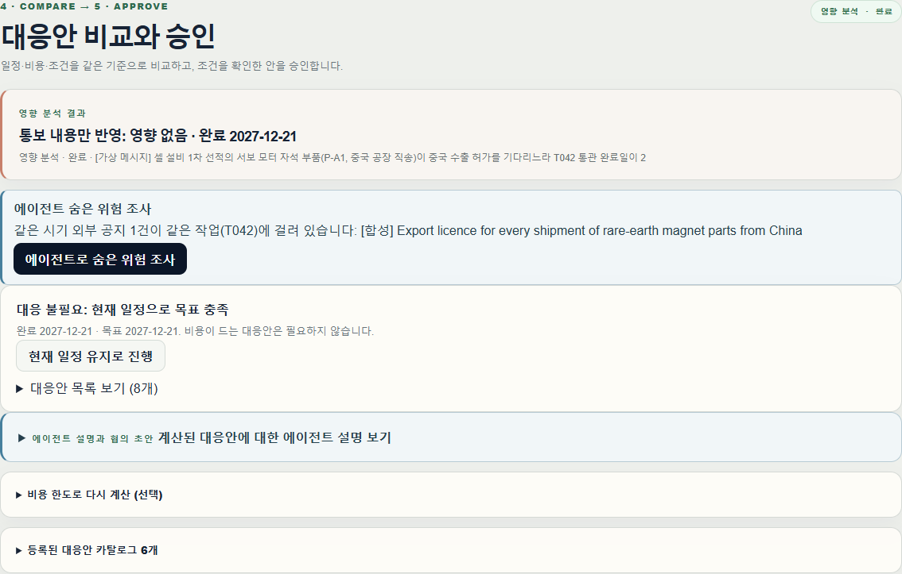
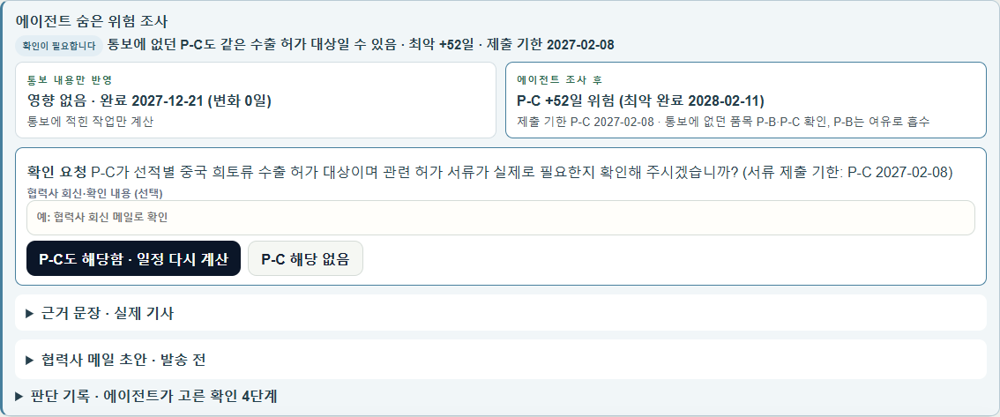
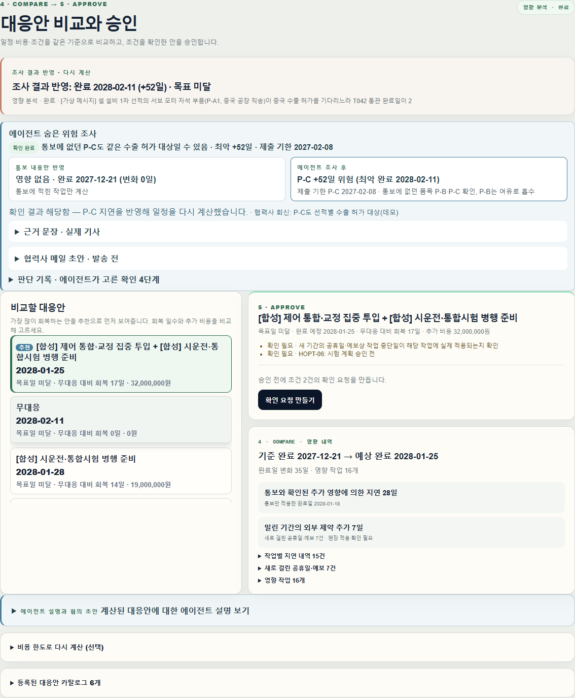
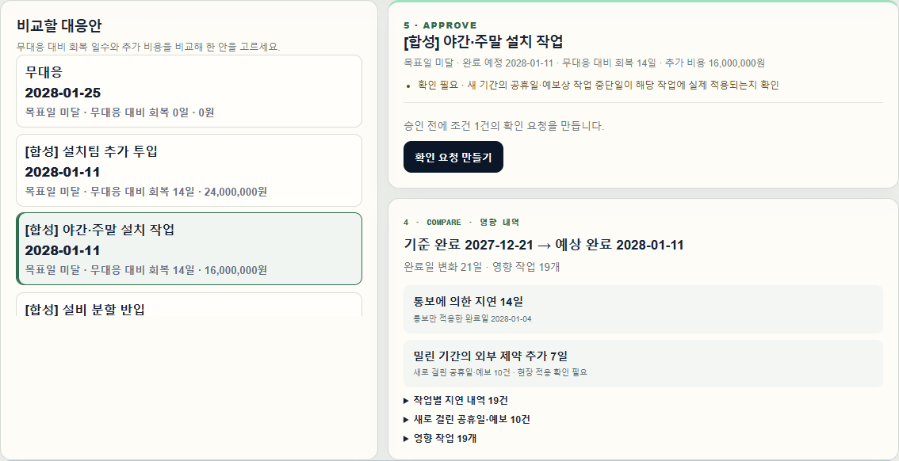
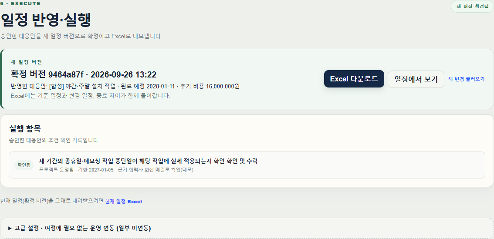

# REPLAN 데모 가이드

작업공간은 6단계를 순서대로 진행합니다: **개요 → 일정 → 변경 → 대응안 → 실행 → 이력**. 각 화면에서 진하게 강조된 버튼이 지금 누를 버튼이고, 위쪽 단계 표시는 보고 있는 결과의 진행 상태를 보여줍니다. 에이전트 기능은 **대응안** 화면의 '에이전트로 숨은 위험 조사'와 접힌 '에이전트 설명'에 있습니다. 전체 요약은 [인수인계 문서](HANDOFF.md)에 있습니다.

## 준비

```cmd
scripts\demo.cmd
```

(macOS·Linux: `scripts/demo.sh`) 평소 스택을 멈추고(데이터는 유지) 별도의 깨끗한 데이터로, 녹화된 LLM 응답을 재생하는 모드(`REPLAN_LLM_MODE=replay`)로 띄웁니다. 키·비용 없이 에이전트가 동작하며 화면 위쪽에 "에이전트 켜짐 · 녹화본 재생 중(비용 0)"이 보입니다. "에이전트 꺼짐"이 보이면 이 스크립트로 다시 띄우세요. 다음에 깨끗하게 다시 시작하려면 `docker compose -p replan-demo down -v` 후 스크립트를 다시 실행합니다.

`http://localhost:3000` → **데모 보기 → 워크스페이스 열기 → 프로젝트 만들기**(이름은 자유) → **일정**에서 **hero 데모 기준 일정 연결**(64개 작업).

## 장면 1 — X2: 통보에 없던 숨은 위험

| # | 누를 곳 | 정상이면 보이는 것 |
| --- | --- | --- |
| 1 | **변경** → 합성 통보 목록 맨 위 '대표 데모'의 `X2 · 대표 데모 …` → **합성 통보 불러오기** | 변경 카드 **1장**(X2 협력사 통보). "통보에서 읽어낸 변경 (확인 필요): T042 … 2026-03-14", 아래 **관련 외부 신호 5건**: 감시 피드에서 들어온 합성 공지 N-X2(관련 있음, 같은 작업 T042·같은 사유 '수출 허가')와 유사 위험 실제 기사 4건(CNBC·NC Newsline·Washington Post·Bloomberg, 제목·출처·날짜·링크·관련 이유), "기사 속 지연 일수는 계산에 쓰지 않음" |
| 2 | (선택) 아래 **외부 변화 감시 (선택)** 펼치기 | '감시 피드에서 들어온 신호 1건': N-X2가 **관련 있음**으로 표시되고 X2 통보 카드에 들어가 있음 |
| 3 | X2 카드의 **해석 확인 후 영향 분석**(이 화면의 유일한 진한 버튼) | **대응안** 화면으로 자동 이동. 단계 표시 1~4 완료·5 조건 승인이 지금 할 단계. "통보 내용만 반영: 영향 없음 · 완료 2027-12-21", "대응 불필요: 현재 일정으로 목표 충족" |
| 4 | 같은 화면의 **에이전트로 숨은 위험 조사** | 몇 초 뒤 한 줄 결론 "통보에 없던 P-C도 같은 수출 허가 대상일 수 있음 · 최악 +52일 · 제출 기한 2027-02-08"과 비교 카드 **통보 내용만 반영**(영향 없음) 대 **에이전트 조사 후**(P-C +52일 위험, 최악 완료 2028-02-11) |
| 5 | (선택) 접힌 **근거 문장 · 실제 기사**, **협력사 메일 초안**, **판단 기록** 펼치기 | 원문 강조와 근거 기사(CNBC 2025-10-15), 제출 기한이 들어간 메일 초안, 확인 4단계와 LLM 호출 수·비용 |
| 6 | 확인 요청 칸에 회신 내용 입력(선택) → **P-C도 해당함 · 일정 다시 계산** | "조사 결과 반영: 완료 2028-02-11 (+52일)". 계산이 끝나면 대응안 목록 맨 위에 **추천** "제어 통합·교정 집중 투입 + 시운전·통합시험 병행 준비" **2028-01-25 · 회복 17일 · 32,000,000원**이 선택된 상태 |
| 7 | 오른쪽 **확인 요청 만들기** → 조건마다 회신 근거 입력 → **확인 기록** → **이 대응안 승인** | 실행 화면으로 이동 |
| 8 | **새 일정 버전 확정** → **Excel 다운로드** | 확정 버전 카드, 단계 표시 6단계 모두 완료, `replan-….xlsx`의 '변경 일정' 시트 마지막 완료일 2028-01-25 |

6번에서 **P-C 해당 없음**을 고르면 통보 내용만 반영한 결과(2027-12-21)를 유지하고, **현재 일정 유지로 진행**으로 승인할 수 있습니다.







## 장면 2 — H04: 결정적 계산과 비용 효율

| # | 누를 곳 | 정상 화면 |
| --- | --- | --- |
| 1 | **변경** → 합성 통보 `H04 · Logistics Partner / 가상 메일` → **합성 통보 불러오기** | 해석된 변경 **T045 · 완료 예정일 2026-12-28** |
| 2 | **해석 확인 후 영향 분석** | 대응안 화면으로 이동 |
| 3 | 대응안 목록 | 맨 위 **추천** 두 안 조합 2027-12-28(회복 28일), 무대응 **2028-01-25**(35일 지연), 설치팀 추가·야간 작업 등 **2028-01-11**(회복 14일) |
| 4 | `무대응` 선택 | 영향 내역: 통보에 의한 지연 **21일**, 밀린 기간의 외부 제약 추가 **14일**(새로 걸린 공휴일) |
| 5 | 아래 **계산된 대응안에 대한 에이전트 설명 보기** 펼치기 | LLM 호출 1회·비용, 계산된 8개 안의 설명(옵션 ID별), 확인할 내용, 협력사 메일 초안 |
| 6 | `[합성] 야간·주말 설치 작업` → **확인 요청 만들기** → 회신 근거 입력 → **확인 기록** | 조건이 `확인됨`, **이 대응안 승인** 활성 |
| 7 | **이 대응안 승인** | 실행 화면으로 이동 |
| 8 | **새 일정 버전 확정** → **Excel 다운로드** | 확정 버전 카드, `replan-<프로젝트ID>-<버전>.xlsx` |




승인 전에는 '새 일정 버전 확정'이 나타나지 않고, 조건을 확인하기 전에는 '승인'이 비활성입니다.

## 테스트·평가용

아래 시나리오는 회귀 테스트·평가용이며 합성 통보 목록의 '테스트용' 묶음에서 불러올 수 있습니다.

| 자료 | 내용 |
| --- | --- |
| H01~H08 | 협력사 통보 원본. H02 규제 언급(조건부로만 남김), H06 완료일 미정(질문), H07 연락처만 변경(영향 없음), H08 정정 통보 |
| V01~V11 | 표현 변형. V08처럼 작업 번호가 없으면 에이전트가 원문 인용과 함께 후보를 제시하고, 사람이 **영향 작업과 날짜 지정** 후에만 계산 |
| X1-A | EU 역외 설치·시운전 기술자 취업 허가 확인 공지(근거 RS-001). 녹화된 모델은 Vendor A가 비EU 기술자를 투입하는지 먼저 묻고 멈춤 |
| X1-B | 헝가리 인허가 처리 지연(최대 45일). T013 여유로 흡수되어 알림 없이 "완료일 영향 없음 · 기록만" |
| X2-대조 | 사유(시험 인력)가 달라 N-X2와 연결하지 않음("관련 없음 · 기록만"). 사유가 겹치지 않는 공지는 통보 카드에 합치지 않고 별도 카드로 남음 |
| `REPLAN_demo_inputs.xlsx` | 일정 → Excel 파일 선택 → 업로드·미리보기 → 기준 일정 확정. 변경 이벤트 행은 자동 등록되지 않으므로 원문을 붙여 넣음 |
| 외부 변화 감시 | 변경 화면 아래 '외부 변화 감시'에서 제안 수락·제외 후 활성화. 감지된 변화는 통보 내용과 계산기로만 정리되고, 에이전트는 사람이 조사·분석을 시작할 때만 실행. 무엇을 가져오는지는 [인수인계 문서](HANDOFF.md#외부-변화-감시가-가져오는-것) 참고 |

녹화된 흐름 10개(H04, H02, V08, 외부 공지, 공휴일, X2, X2-대조, X1-A, X1-B, X2 확인 후 재계산)는 `python scripts/agent_flows.py --mode replay`로 비용 없이 재생해 확인합니다. 에이전트 모드별 차이:

| 모드 | 설정 | 동작 |
| --- | --- | --- |
| 에이전트 꺼짐 | 기본(키 없음 또는 `REPLAN_PAID_CALLS_ENABLED=false`) | 통보 내용과 계산기만. 화면 위쪽에 "에이전트 꺼짐"과 켜는 방법(`scripts\demo.cmd`) 표시 |
| 재생 | `REPLAN_LLM_MODE=replay` | 녹화된 응답으로 에이전트 동작, 비용 0. 녹화와 다른 요청은 멈춤 |
| 실제 | 키 + `REPLAN_PAID_CALLS_ENABLED=true` | 작업·날짜 없는 통보 해석 1회, 정식 분석 설명 1회, 사람이 시작한 조사(최대 6회). 잠정 분석과 자동 감지는 LLM 없음 |

고급 설정(실행 화면 아래: 협력사 휴무일, 공개 피드, 메일·알림 연결 등)의 연동 여부는 화면에 `분석에 반영`·`저장만`·`미연동`으로 표시됩니다.
