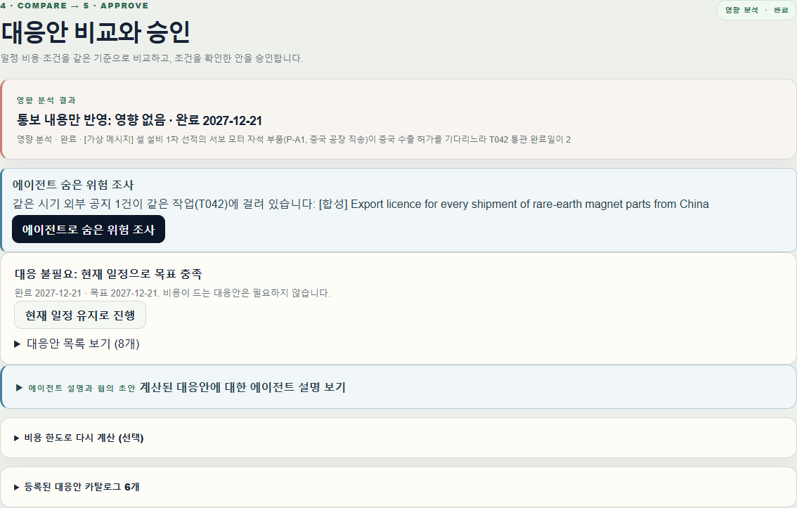
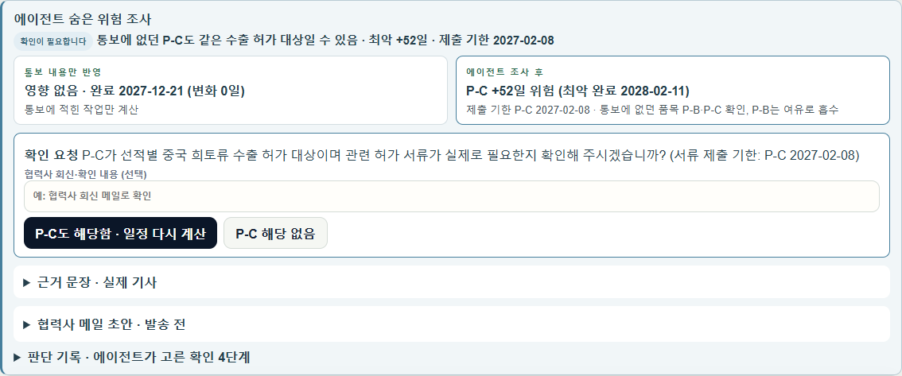
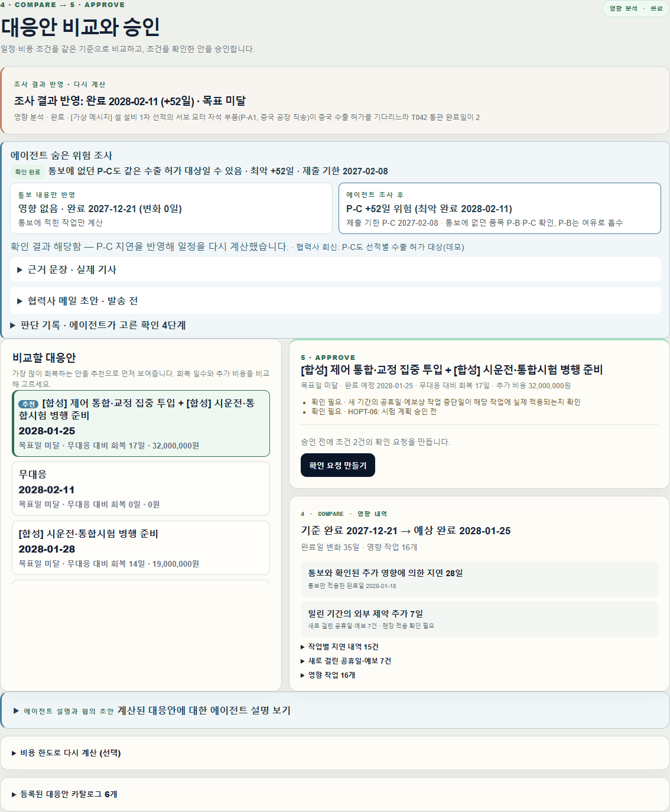
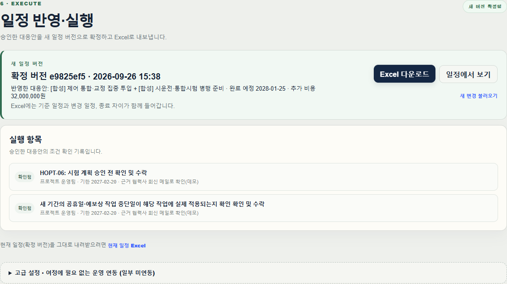
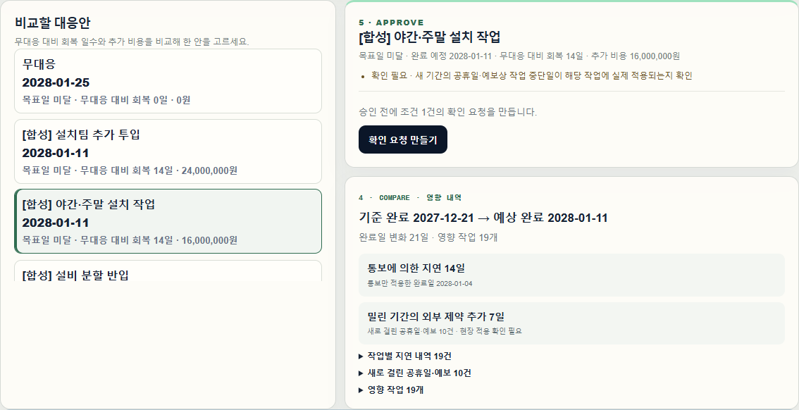
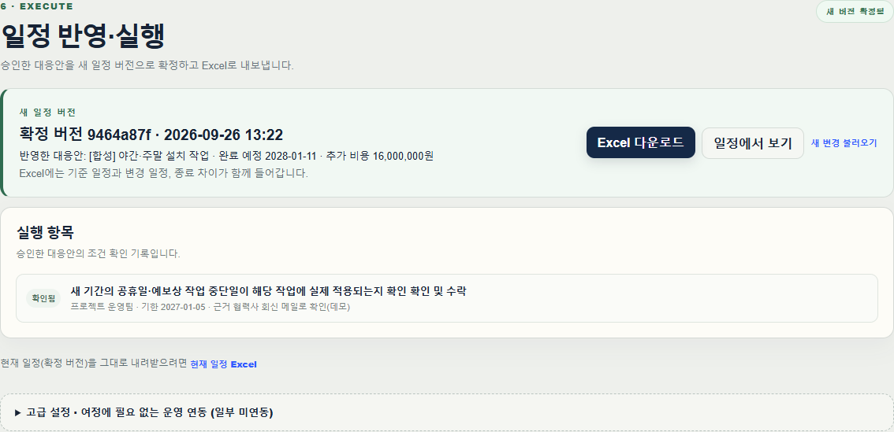

# REPLAN 데모 가이드

처음 볼 때는 `/demo`에서 **대표 사례 바로 시작**을 누르세요. 예시 프로젝트, 기준 일정, 외부 공지가 자동으로 준비되고 **변경** 화면이 열립니다. 받은편지함의 대표 통보부터 시작하면 됩니다.

작업공간의 전체 진행 과정은 **개요 → 일정 → 감시 → 변경 → 대응안 → 실행 → 이력**입니다. 왼쪽 메뉴는 준비·위험 확인·결정과 기록으로 묶였고, 세부 진행 단계는 필요할 때만 **전체 진행 과정**을 펼쳐 볼 수 있습니다.

| 구성 | 화면 | 하는 일 |
| --- | --- | --- |
| 워커 (수집·변화 감지, AI 아님) | 감시 | 등록 출처·공휴일·기상 수집. 데모는 **감시 시작**이 한 번의 수집을 시뮬레이션 |
| 사전 에이전트: 등록 시 브리핑 | 감시 | 기준 일정의 위험 상위 3~5개. 순위는 계산기, 에이전트는 최대 3회 확인과 L2 근거 연결 |
| 사전 에이전트: 변화 자동 추리기 | 감시(피드) | 들어온 공지를 관련 있음 / 확인 필요 / 무관으로 1회 분류 |
| 사후 에이전트: 협력사 통보 조사 | 대응안 | 사람이 **에이전트로 숨은 위험 조사**를 누를 때만 실행 |
| 리스크 대장 | 감시 | 세 에이전트가 함께 읽고 씀. 예상됨 → 신호 감지 → 발생 → 대응 중 → 종결 |
| 사람 | 모든 화면 | 확인과 승인 |

전체 요약은 [인수인계 문서](HANDOFF.md)에 있습니다.

## 준비

```cmd
scripts\demo.cmd
```

(macOS·Linux: `scripts/demo.sh`) 평소 스택을 멈추고(데이터는 유지) 별도의 깨끗한 데이터로, 녹화된 LLM 응답을 재생하는 모드(`REPLAN_LLM_MODE=replay`)로 띄웁니다. 키·비용 없이 에이전트가 동작하며 화면 위쪽에 "에이전트 켜짐 · 녹화본 재생 중(비용 0)"이 보입니다. "에이전트 꺼짐"이 보이면 이 스크립트로 다시 띄우세요. 다음에 깨끗하게 다시 시작하려면 `docker compose -p replan-demo down -v` 후 스크립트를 다시 실행합니다.

`http://localhost:3000` → **데모 보기 → 대표 사례 바로 시작**. 아래 장면 1의 1~3번(프로젝트 생성·일정 연결·감시 시작)은 자동으로 준비됩니다. 각 단계를 직접 재현하려면 **기존 프로젝트 열기 → 프로젝트 만들기**로 들어가세요.

## 장면 1 — X2: 등록 때 예상한 위험이 통보로 발생

| # | 화면 · 누를 곳 | 정상이면 보이는 것 |
| --- | --- | --- |
| 1 | **일정** → **hero 데모 기준 일정 연결** | 64개 작업 일정. 일정 화면에는 연결만 있고, "다음 단계 · 감시 시작 →" 안내가 나옴. 아직 변경·신호는 없음 |
| 2 | **감시 시작 →** | 감시 화면. 몇 초 뒤 **등록 시 위험 브리핑**("규칙 + 에이전트 확인", 일정 기준 2025-08-20 · 근거 기준 2025-10-20). 1순위 **중국산 통관 품목**(P-A1·P-B·P-C, 속성 3개 × 여유 0일)과 빨간 줄 "P-C: 여유 0일이라 취약합니다(주공정)". 파란 상자 **"에이전트가 L2 근거로 연결한 원인: 중국 희토류 자석 수출 통제 · RS-019"**. 엑셀에는 원산지·통관·원산지 증명·품목명(희토류 자석 포함)만 있고 위험은 적혀 있지 않음. 품목마다 여유, 선제 행동(예: P-C 원산지 증명·교정 성적서 준비 상황 확인 · 2027-03-26까지). 비어 있는 속성은 "속성 없음". 아래 리스크 대장의 위험 5개는 모두 '예상됨' |
| 3 | 같은 화면의 **감시 시작 · 데모 수집 시뮬레이션** | 감시 피드에 합성 공지 N-X2(중국산 희토류 자석 부품 선적별 수출 허가, 검토 최대 60일)가 들어오고 **변화 자동 추리기**가 한 번 분류: 관련 있음 4(T020·T044·T051·T058), 확인 필요 15(체크박스), **무관 12건 제외 · 이유 보기**(접힘). 리스크 대장 R-import-CN이 **신호 감지**. 조사는 자동으로 시작하지 않고 **에이전트로 조사** 버튼만 보임. 위쪽 안내는 **변경 불러오기 →** |
| 4 | **변경 불러오기 →** → 받은편지함의 `대표 데모` 행 ([P-A1] 서보 모터 자석 부품 통관 지연) → **변경으로 등록** | 받은편지함은 보낸 사람·제목·받은 시각·미리보기 목록과 본문 보기. 변경 카드 **1장**: "T042 … 2026-03-14", **관련 외부 신호**에 N-X2(같은 작업 T042·같은 사유 '수출 허가', "자동 추리기: 관련 있음 …")와 유사 위험 실제 기사 |
| 5 | X2 카드의 **해석 확인 후 영향 분석** | **대응안** 화면으로 이동. "통보 내용만 반영: 영향 없음 · 완료 2027-12-21", "대응 불필요: 현재 일정으로 목표 충족" |
| 6 | **에이전트로 숨은 위험 조사** | 한 줄 결론 "통보에 없던 P-C도 같은 수출 허가 대상일 수 있음 · 최악 +52일 · 제출 기한 2027-02-08", 빨간 상자 **"등록 시 예상했던 위험이 발생함: R-import-CN 중국산 통관 품목 · 중국 희토류 자석 수출 통제"**(신호 감지 → 발생, 등록 때 경고한 P-C 주공정 문구), 비교 카드 **통보 내용만 반영**(영향 없음) 대 **에이전트 조사 후**(P-C +52일 위험, 최악 완료 2028-02-11, P-B는 여유로 흡수) |
| 7 | (선택) 접힌 **근거 문장 · 실제 기사**, **협력사 메일 초안**, **판단 기록** | 원문 강조와 근거 기사(CNBC 2025-10-15), 제출 기한이 들어간 메일 초안, 에이전트가 고른 확인과 LLM 호출 수·비용 |
| 8 | **P-C도 해당함 · 일정 다시 계산** | "조사 결과 반영: 완료 2028-02-11 (+52일)". 추천 "제어 통합·교정 집중 투입 + 시운전·통합시험 병행 준비" **2028-01-25 · 회복 17일 · 32,000,000원** |
| 9 | **확인 요청 만들기** → 조건마다 회신 근거 입력 → **확인 기록** → **이 대응안 승인** → **새 일정 버전 확정** → **Excel 다운로드** | 7단계 모두 완료. `replan-….xlsx`의 '변경 일정' 시트 마지막 완료일 2028-01-25 |
| 10 | **감시** → 리스크 대장 R-import-CN → **근거와 변경 이력** | 예상됨(등록 시 브리핑) → 신호 감지(변화 자동 추리기, N-X2 인용) → 발생(사후 조사 에이전트) → 대응 중(사람 확인). **사람이 상태 바꾸기**로 '종결' 기록 가능 |

8번에서 **P-C 해당 없음**을 고르면 통보 내용만 반영한 결과(2027-12-21)를 유지하고, **현재 일정 유지로 진행**으로 승인할 수 있습니다. 감시를 시작하지 않고 X2를 등록하면 같은 시기 공지가 없어 조사할 것이 없습니다(받은편지함에 안내가 나옴).








## 장면 2 — H04: 결정적 계산과 비용 효율

| # | 누를 곳 | 정상 화면 |
| --- | --- | --- |
| 1 | 새 프로젝트 → **일정**에서 hero 연결 → **감시 시작 →** → **감시 시작 · 데모 수집 시뮬레이션** → **변경 불러오기 →** | 받은편지함 |
| 2 | 받은편지함의 `[T045] 현장 설비 반입 완료일 변경`(Logistics Partner) → **변경으로 등록** | 해석된 변경 **T045 · 완료 예정일 2026-12-28** |
| 3 | **해석 확인 후 영향 분석** | 대응안 화면으로 이동 |
| 4 | 대응안 목록 | 맨 위 **추천** 두 안 조합 2027-12-28(회복 28일), 무대응 **2028-01-25**(35일 지연), 설치팀 추가·야간 작업 등 **2028-01-11**(회복 14일) |
| 5 | `무대응` 선택 | 영향 내역: 통보에 의한 지연 **21일**, 밀린 기간의 외부 제약 추가 **14일**(새로 걸린 공휴일) |
| 6 | 아래 **계산된 대응안에 대한 에이전트 설명 보기** 펼치기 | LLM 호출 1회·비용, 계산된 8개 안의 설명(옵션 ID별), 확인할 내용, 협력사 메일 초안 |
| 7 | 추천 안 → **확인 요청 만들기** → 회신 근거 입력 → **확인 기록** → **이 대응안 승인** | 실행 화면으로 이동 |
| 8 | **새 일정 버전 확정** → **Excel 다운로드** | 확정 버전 카드, '변경 일정' 마지막 완료일 2027-12-28 |




승인 전에는 '새 일정 버전 확정'이 나타나지 않고, 조건을 확인하기 전에는 '승인'이 비활성입니다.

## 테스트·평가용

아래 시나리오는 회귀 테스트·평가용입니다. 협력사 통보는 받은편지함의 '테스트' 행으로, 외부 공지는 **감시** 화면 아래 **테스트용 공지 수집**으로 불러옵니다.

| 자료 | 내용 |
| --- | --- |
| H01~H08 | 협력사 통보 원본. H02 규제 언급(조건부로만 남김), H06 완료일 미정(질문), H07 연락처만 변경(영향 없음), H08 정정 통보 |
| V01~V11 | 표현 변형. V08처럼 작업 번호가 없으면 에이전트가 원문 인용과 함께 후보를 제시하고, 사람이 **영향 작업과 날짜 지정** 후에만 계산 |
| X1-A | EU 역외 설치·시운전 기술자 취업 허가 확인 공지(근거 RS-001). 자동 추리기가 후보 26개를 확인 필요 9 · 무관 17로 나누고(관련 있음 0), 조사는 계산할 작업이 없어 9개 현장 작업마다 비EU 기술자가 오는지 묻고 멈춤(M4) |
| X1-B | 헝가리 인허가 처리 지연(최대 45일). 자동 추리기가 T008·T012·T013·T029·T057을 모두 확인 필요로 둠. 사람이 T013을 골라 조사하면 T013만 계산해 여유 168일로 흡수, 알림 없이 "완료일 영향 없음 · 기록만"(M2) |
| X2-대조 | 사유(시험 인력)가 달라 N-X2와 연결하지 않음("관련 없음 · 기록만"), 리스크 대장에도 연결하지 않음 |
| `REPLAN_demo_inputs.xlsx` | 일정 → Excel 파일 선택 → 업로드·미리보기 → 기준 일정 확정. 변경 이벤트 행은 자동 등록되지 않으므로 원문을 붙여 넣음 |
| 실제 감시 | 감시 화면의 **감시 계획 설정**에서 제안을 수락·제외하고 활성화한 뒤 **감시 시작**. 들어온 공지는 변화 자동 추리기가 1회 분류(별도 일일 한도)하고, 조사·분석은 사람이 시작할 때만 실행. 무엇을 가져오는지는 [인수인계 문서](HANDOFF.md#외부-변화-감시가-가져오는-것) 참고 |

녹화된 흐름 11개(등록 시 브리핑, H04, H02, V08, 외부 공지, 공휴일, X2, X2-대조, X1-A, X1-B, X2 확인 후 재계산)는 `python scripts/agent_flows.py --mode replay`로 비용 없이 재생해 확인합니다. 에이전트 모드별 차이:

| 모드 | 설정 | 동작 |
| --- | --- | --- |
| 에이전트 꺼짐 | 기본(키 없음 또는 `REPLAN_PAID_CALLS_ENABLED=false`) | 통보 내용과 계산기만. 브리핑은 규칙 순위만. 화면 위쪽에 "에이전트 꺼짐"과 켜는 방법(`scripts\demo.cmd`) 표시 |
| 재생 | `REPLAN_LLM_MODE=replay` | 녹화된 응답으로 에이전트 동작, 비용 0. 녹화와 다른 요청은 멈춤 |
| 실제 | 키 + `REPLAN_PAID_CALLS_ENABLED=true` | 등록 시 브리핑(도구 확인 최대 3회), 새 공지의 자동 추리 1회(별도 한도), 작업·날짜 없는 통보의 해석 1회(잠정 분석에서도), 정식 분석의 대응안 설명, 사람이 시작한 조사(최대 6턴). 자세한 기준은 [README의 AWS LLM API 호출 원칙](../README.md#aws-llm-api-호출-원칙과-비용-통제) |

고급 설정(실행 화면 아래: 협력사 휴무일, 공개 피드, 메일·알림 연결 등)의 연동 여부는 화면에 `분석에 반영`·`저장만`·`미연동`으로 표시됩니다. 받은편지함은 지금 합성 메일을 보여 주며, 메일 연결은 같은 목록 구조(`apps/web/app/inbox.tsx`의 `InboxMessage`)에 데이터 출처만 바꿔 붙이도록 준비되어 있습니다(실제 Gmail 연결은 아직 없음).
